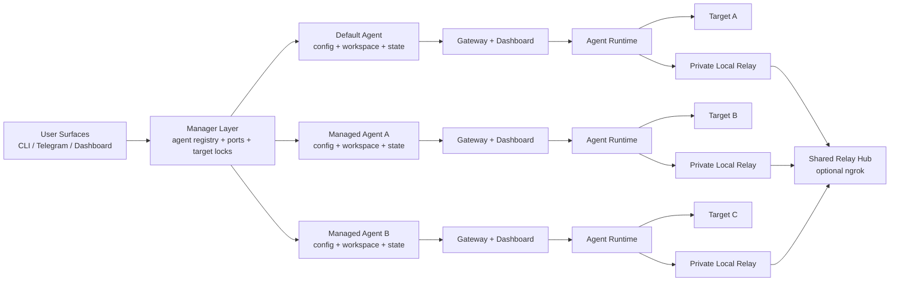

# OpenPocket

<p align="center">
  
</p>

<p align="center">
  <strong>An Intelligent Phone That Never Sleeps</strong><br/>
  OpenPocket is a local-first phone-use agent framework with privacy by default.
</p>

<p align="center">
  <a href="https://www.openpocket.ai/hubs#doc-hubs">Documentation Hubs</a>
</p>

[](https://nodejs.org/)
[](https://www.typescriptlang.org/)
[](https://github.com/SergioChan/openpocket/actions/workflows/node-tests.yml)

## Simple Introduction

OpenPocket runs AI agents against configurable Android targets through `adb`, while keeping runtime state, session logs, and human-auth artifacts on your own machine.

Each onboarded install starts with one **default agent**. You can later create additional **isolated agent instances** with their own:

- `config.json`
- `workspace/`
- `state/`
- bound target
- channels
- gateway process
- dashboard

Agents do **not** share workspace data or targets. They can, however, share one management dashboard and one relay/ngrok entry for human-auth flows.

For product overview and docs map:
- Documentation hub: [https://www.openpocket.ai/hubs#doc-hubs](https://www.openpocket.ai/hubs#doc-hubs)
- Project blueprint: [https://www.openpocket.ai/concepts/project-blueprint](https://www.openpocket.ai/concepts/project-blueprint)
- Multi-agent setup: [https://www.openpocket.ai/get-started/multi-agent](https://www.openpocket.ai/get-started/multi-agent)

## Install

### Option A: npm (recommended)

```bash
npm install -g openpocket
openpocket onboard
```

### Option B: source clone (for contributors)

```bash
git clone git@github.com:SergioChan/openpocket.git
cd openpocket
npm install
npm run build
./openpocket onboard
```

Setup reference:
- Quickstart: [https://www.openpocket.ai/get-started/quickstart](https://www.openpocket.ai/get-started/quickstart)
- Device targets: [https://www.openpocket.ai/get-started/device-targets](https://www.openpocket.ai/get-started/device-targets)
- Configuration: [https://www.openpocket.ai/get-started/configuration](https://www.openpocket.ai/get-started/configuration)
- Multi-agent setup: [https://www.openpocket.ai/get-started/multi-agent](https://www.openpocket.ai/get-started/multi-agent)

## Run

### Start the default agent gateway

```bash
openpocket gateway start
```

### Run a direct task from CLI

```bash
openpocket agent --model gpt-5.2-codex "Open Chrome and search weather"
```

### Create more isolated agents

```bash
openpocket create agent review-bot --type physical-phone --device R5CX123456A
openpocket create agent ops-bot --type emulator
openpocket agents list
```

Then target a specific agent with `--agent`:

```bash
openpocket --agent review-bot config-show
openpocket --agent review-bot gateway start
openpocket --agent review-bot target show
openpocket --agent review-bot channels login --channel discord
```

### Manager dashboard and shared relay hub

```bash
openpocket dashboard manager
openpocket human-auth-relay start
```

- `openpocket dashboard manager` shows every registered agent, its target binding, configured channels, dashboard URL, and gateway status.
- `openpocket human-auth-relay start` starts one shared relay hub for all managed agents, with one optional ngrok public URL.

### Optional target setup examples

```bash
openpocket target show
openpocket target set --type emulator
openpocket target set --type physical-phone
openpocket target pair --host <device-ip> --pair-port <pair-port> --code <pairing-code> --type physical-phone
openpocket --agent review-bot target set --type physical-phone --device R5CX123456A
```

Runtime and target references:
- Device targets: [https://www.openpocket.ai/get-started/device-targets](https://www.openpocket.ai/get-started/device-targets)
- CLI and gateway reference: [https://www.openpocket.ai/reference/cli-and-gateway](https://www.openpocket.ai/reference/cli-and-gateway)
- Filesystem layout: [https://www.openpocket.ai/reference/filesystem-layout](https://www.openpocket.ai/reference/filesystem-layout)

### Manage model profiles

Model config is per agent. `create agent` seeds new agents from the initial onboard model template, then each agent can diverge.

```bash
openpocket model show
openpocket model list
openpocket model set --name gpt-5.4
openpocket --agent review-bot model set --provider google --model gemini-3.1-pro-preview
```

### Control gateway log noise

Set `gatewayLogging` in config to tune level, payload redaction, and module-level output:

```json
{
  "gatewayLogging": {
    "level": "info",
    "includePayloads": false,
    "maxPayloadChars": 160,
    "modules": {
      "core": true,
      "access": true,
      "task": true,
      "channel": true,
      "cron": true,
      "heartbeat": false,
      "humanAuth": true,
      "chat": false
    }
  }
}
```

## Detailed Architecture



### Mechanisms and Components

1. Multi-agent manager layer
   - One onboarded install can host one default agent plus many managed agents.
   - Each managed agent gets isolated config/workspace/state, while target locks and port allocation are coordinated centrally.
   - Docs: [https://www.openpocket.ai/get-started/multi-agent](https://www.openpocket.ai/get-started/multi-agent), [https://www.openpocket.ai/reference/filesystem-layout](https://www.openpocket.ai/reference/filesystem-layout)

2. Gateway orchestration
   - Each agent runs its own gateway, dashboard, session store, channel credentials, and task queue.
   - Docs: [https://www.openpocket.ai/reference/cli-and-gateway](https://www.openpocket.ai/reference/cli-and-gateway), [https://www.openpocket.ai/ops/runbook](https://www.openpocket.ai/ops/runbook)

3. Prompting and model loop
   - System/user prompt composition, context budgeting, and model-driven step execution remain local to one agent workspace.
   - Docs: [https://www.openpocket.ai/concepts/prompting](https://www.openpocket.ai/concepts/prompting), [https://www.openpocket.ai/reference/prompt-templates](https://www.openpocket.ai/reference/prompt-templates)

4. Tool execution layer
   - ADB phone actions, coding tools (`read/write/edit/exec/...`), memory tools, and scripts.
   - Docs: [https://www.openpocket.ai/reference/action-schema](https://www.openpocket.ai/reference/action-schema), [https://www.openpocket.ai/tools/scripts](https://www.openpocket.ai/tools/scripts), [https://www.openpocket.ai/tools/skills](https://www.openpocket.ai/tools/skills)

5. Capability probe and human authorization
   - Sensitive actions (camera/payment/location/etc.) can be escalated to Human Auth approval with delegated artifacts.
   - In multi-agent installs, agents can share one relay hub and one ngrok URL while still storing request state per agent.
   - Docs: [https://www.openpocket.ai/concepts/remote-human-authorization](https://www.openpocket.ai/concepts/remote-human-authorization)

6. Device target abstraction
   - Every agent binds to exactly one target at a time.
   - Targets cannot be shared across agents.
   - Docs: [https://www.openpocket.ai/get-started/device-targets](https://www.openpocket.ai/get-started/device-targets)

7. Persistence and auditability
   - Sessions, memory, screenshots, relay state, and generated artifacts are stored inside each agent's workspace/state.
   - Docs: [https://www.openpocket.ai/reference/filesystem-layout](https://www.openpocket.ai/reference/filesystem-layout), [https://www.openpocket.ai/reference/session-memory-formats](https://www.openpocket.ai/reference/session-memory-formats)

8. Runtime operations and troubleshooting
   - Manager dashboard, per-agent dashboards, keep-awake heartbeat, and troubleshooting playbooks.
   - Docs: [https://www.openpocket.ai/ops/runbook](https://www.openpocket.ai/ops/runbook), [https://www.openpocket.ai/ops/troubleshooting](https://www.openpocket.ai/ops/troubleshooting), [https://www.openpocket.ai/ops/screen-awake-heartbeat](https://www.openpocket.ai/ops/screen-awake-heartbeat)

## Contribute

We welcome issues and pull requests.

Read the full contribution guide before opening a PR:
- [CONTRIBUTING.md](./CONTRIBUTING.md)
- [contribution.md](./contribution.md)

1. Fork and create a feature branch.
2. Keep changes focused and add/update tests.
3. Run checks locally:

```bash
npm install
npm run check
npm run test
npm run smoke:dual-side
npm run docs:build
```

4. Submit a PR with context, scope, and verification notes.

Contributor references:
- Docs hub: [https://www.openpocket.ai/hubs#doc-hubs](https://www.openpocket.ai/hubs#doc-hubs)
- Skills guide: [https://www.openpocket.ai/tools/skills](https://www.openpocket.ai/tools/skills)

## Open Source License

This project is licensed under the **MIT License**.

See [LICENSE](./LICENSE) for details.

## Thanks

Special thanks to the open-source projects that make OpenPocket possible:

- pi-mono ecosystem by Mario Zechner:
  - `@mariozechner/pi-agent-core`
  - `@mariozechner/pi-ai`
  - `@mariozechner/pi-coding-agent`
- Messaging and channel SDKs:
  - `node-telegram-bot-api`
  - `discord.js`
  - `baileys`
- Core runtime and schema/tooling:
  - `openai`
  - `@modelcontextprotocol/sdk`
  - `zod`
  - `@sinclair/typebox`
  - `sharp`
  - `qrcode` / `qrcode-terminal`
- Docs and developer tooling:
  - `vitepress`
  - `mermaid`
  - `typescript`
  - `tsx`

- Contributors across runtime, gateway, docs, and operations
- Community users who continuously report issues and share real-world scenarios

And thanks for building with OpenPocket.
