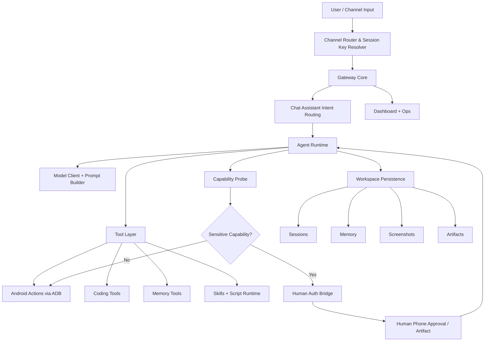

# OpenPocket

<p align="center">
  
</p>

<p align="center">
  <strong>An Intelligent Phone That Never Sleeps</strong><br/>
  OpenPocket is a local-first phone-use agent framework with privacy by default.
</p>

<p align="center">
  <a href="https://www.openpocket.ai/hubs#doc-hubs">Documentation Hubs</a>
</p>

[](https://nodejs.org/)
[](https://www.typescriptlang.org/)
[](https://github.com/SergioChan/openpocket/actions/workflows/node-tests.yml)

## Simple Introduction

OpenPocket runs an AI agent against your configurable **Agent Phone** target (emulator or physical Android phone), while keeping runtime state and sensitive data in your local environment.

For product overview and docs map:
- Documentation hub: [https://www.openpocket.ai/hubs#doc-hubs](https://www.openpocket.ai/hubs#doc-hubs)
- Project blueprint: [https://www.openpocket.ai/concepts/project-blueprint](https://www.openpocket.ai/concepts/project-blueprint)

## Install

### Option A: npm (recommended)

```bash
npm install -g openpocket
openpocket onboard
```

### Option B: source clone (for contributors)

```bash
git clone git@github.com:SergioChan/openpocket.git
cd openpocket
npm install
npm run build
./openpocket onboard
```

Setup reference:
- Quickstart: [https://www.openpocket.ai/get-started/quickstart](https://www.openpocket.ai/get-started/quickstart)
- Configuration: [https://www.openpocket.ai/get-started/configuration](https://www.openpocket.ai/get-started/configuration)

## Run

### Start gateway runtime

```bash
openpocket gateway start
```

### Run a direct task from CLI

```bash
openpocket agent --model gpt-5.2-codex "Open Chrome and search weather"
```

### Optional target setup examples

```bash
openpocket target show
openpocket target set --type emulator
openpocket target set --type physical-phone
openpocket target pair --host <device-ip> --pair-port <pair-port> --code <pairing-code> --type physical-phone
```

Runtime and target references:
- Device targets: [https://www.openpocket.ai/get-started/device-targets](https://www.openpocket.ai/get-started/device-targets)
- CLI and gateway reference: [https://www.openpocket.ai/reference/cli-and-gateway](https://www.openpocket.ai/reference/cli-and-gateway)

## Detailed Architecture



### Mechanisms and Components

1. Channel ingress and routing
   - Multi-channel adapters, normalized inbound envelopes, and stable session keys per peer.
   - Docs: [https://www.openpocket.ai/hubs#doc-hubs](https://www.openpocket.ai/hubs#doc-hubs), [https://www.openpocket.ai/reference/cli-and-gateway](https://www.openpocket.ai/reference/cli-and-gateway)

2. Gateway orchestration
   - Command handling, task lifecycle, queueing, progress narration, and channel replies.
   - Docs: [https://www.openpocket.ai/ops/runbook](https://www.openpocket.ai/ops/runbook), [https://www.openpocket.ai/concepts/project-blueprint](https://www.openpocket.ai/concepts/project-blueprint)

3. Prompting and model loop
   - System/user prompt composition, context budgeting, and model-driven step execution.
   - Docs: [https://www.openpocket.ai/concepts/prompting](https://www.openpocket.ai/concepts/prompting), [https://www.openpocket.ai/reference/prompt-templates](https://www.openpocket.ai/reference/prompt-templates)

4. Tool execution layer
   - ADB phone actions, coding tools (`read/write/edit/exec/...`), memory tools, and scripts.
   - Docs: [https://www.openpocket.ai/reference/action-schema](https://www.openpocket.ai/reference/action-schema), [https://www.openpocket.ai/tools/scripts](https://www.openpocket.ai/tools/scripts), [https://www.openpocket.ai/tools/skills](https://www.openpocket.ai/tools/skills)

5. Capability probe and human authorization
   - Sensitive actions (camera/payment/location/etc.) can be escalated to Human Auth approval with delegated artifacts.
   - Docs: [https://www.openpocket.ai/concepts/remote-human-authorization](https://www.openpocket.ai/concepts/remote-human-authorization)

6. Device target abstraction
   - Emulator and physical phone targets with explicit target switching and pairing flow.
   - Docs: [https://www.openpocket.ai/get-started/device-targets](https://www.openpocket.ai/get-started/device-targets)

7. Persistence and auditability
   - Sessions, memory, screenshots, relay state, and generated artifacts persisted in workspace/home paths.
   - Docs: [https://www.openpocket.ai/reference/filesystem-layout](https://www.openpocket.ai/reference/filesystem-layout), [https://www.openpocket.ai/reference/session-memory-formats](https://www.openpocket.ai/reference/session-memory-formats)

8. Runtime operations and troubleshooting
   - Day-2 operations, keep-awake heartbeat, and troubleshooting playbooks.
   - Docs: [https://www.openpocket.ai/ops/runbook](https://www.openpocket.ai/ops/runbook), [https://www.openpocket.ai/ops/troubleshooting](https://www.openpocket.ai/ops/troubleshooting), [https://www.openpocket.ai/ops/screen-awake-heartbeat](https://www.openpocket.ai/ops/screen-awake-heartbeat)

## Contribute

We welcome issues and pull requests.

1. Fork and create a feature branch.
2. Keep changes focused and add/update tests.
3. Run checks locally:

```bash
npm install
npm run check
npm run test
npm run smoke:dual-side
```

4. Submit a PR with context, scope, and verification notes.

Contributor references:
- Docs hub: [https://www.openpocket.ai/hubs#doc-hubs](https://www.openpocket.ai/hubs#doc-hubs)
- Skills guide: [https://www.openpocket.ai/tools/skills](https://www.openpocket.ai/tools/skills)

## Open Source License

This project is licensed under the **MIT License**.

See [LICENSE](./LICENSE) for details.

## Thanks

Special thanks to the open-source projects that make OpenPocket possible:

- pi-mono ecosystem by Mario Zechner:
  - `@mariozechner/pi-agent-core`
  - `@mariozechner/pi-ai`
  - `@mariozechner/pi-coding-agent`
- Messaging and channel SDKs:
  - `node-telegram-bot-api`
  - `discord.js`
  - `baileys`
- Core runtime and schema/tooling:
  - `openai`
  - `@modelcontextprotocol/sdk`
  - `zod`
  - `@sinclair/typebox`
  - `sharp`
  - `qrcode` / `qrcode-terminal`
- Docs and developer tooling:
  - `vitepress`
  - `mermaid`
  - `typescript`
  - `tsx`

- Contributors across runtime, gateway, docs, and operations
- Community users who continuously report issues and share real-world scenarios

And thanks for building with OpenPocket.
