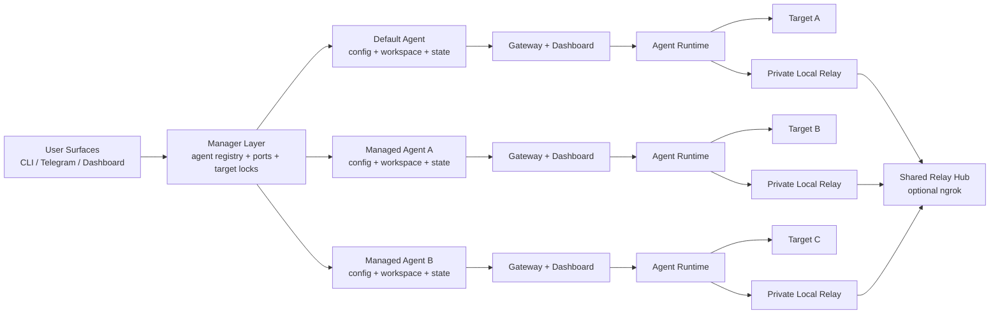

# OpenPocket

<p align="center">
  
</p>

<p align="center">
  <strong>An Intelligent Phone That Never Sleeps</strong><br/>
  Let AI handle your phone-use tasks — locally, privately, autonomously.
</p>

<p align="center">
  <a href="https://www.openpocket.ai">Website</a> &middot;
  <a href="https://www.openpocket.ai/hubs#doc-hubs">Documentation</a> &middot;
  <a href="https://www.openpocket.ai/get-started/quickstart">Quickstart</a> &middot;
  <a href="./CONTRIBUTING.md">Contributing</a>
</p>

<p align="center">
  <a href="https://nodejs.org/">= 20" /></a>
  <a href="https://www.typescriptlang.org/"></a>
  <a href="https://github.com/pockebot/openpocket/actions/workflows/node-tests.yml"></a>
  <a href="./LICENSE"></a>
</p>

---

## What is OpenPocket?

Imagine having a second phone that works for you around the clock — replying to messages, handling payments, playing games, posting on social media — all while your real phone stays safely in your pocket, untouched.

**OpenPocket** is an open-source framework that lets AI agents operate an Android phone on your behalf. Tell it what you want in plain language, and it figures out the rest — tapping, scrolling, typing, navigating between apps — just like a real person would.

- **Local-first** — everything runs on your machine; your data never leaves your computer.
- **Privacy by default** — the agent phone and your personal phone are completely isolated. Sensitive actions require explicit human approval.
- **Emulator + real device** — connect to Android emulators or physical phones over ADB. Run multiple agents against multiple targets to build your own local phone farm.
- **Extensible** — add new capabilities through a single `SKILL.md` file, or build your own agent workflows.

## Demos


<table>
<tr>
<td align="center"><strong>Social</strong><br/>Auto-manage social media<br/><br/>
<video src="https://github.com/user-attachments/assets/0f69cc13-eb98-46f5-8f1d-8ffbea9452e4" width="240" controls muted></video>
</td>
<td align="center"><strong>Gaming</strong><br/>Play mobile games autonomously<br/><br/>
<video src="https://kg6otgbdad5zepkn.public.blob.vercel-storage.com/2.mp4" width="240" controls muted></video>
</td>
<td align="center"><strong>Utility Payment</strong><br/>Handle bills and payments<br/><br/>
<video src="https://kg6otgbdad5zepkn.public.blob.vercel-storage.com/3.mp4" width="240" controls muted></video>
</td>
</tr>
<tr>
<td align="center"><strong>Studying</strong><br/>Assist with learning tasks<br/><br/>
<video src="https://kg6otgbdad5zepkn.public.blob.vercel-storage.com/1.mp4" width="240" controls muted></video>
</td>
<td align="center"><strong>Social</strong><br/>Autopilot your X<br/><br/>
<video src="https://kg6otgbdad5zepkn.public.blob.vercel-storage.com/5.mp4" width="240" controls muted></video>
</td>
<td align="center"><strong>Utility</strong><br/>Find best price/travel option<br/><br/>
<video src="https://kg6otgbdad5zepkn.public.blob.vercel-storage.com/6.mp4" width="240" controls muted></video>
</td>
</tr>
</table>

## Highlights

- **Multi-model** — works with OpenAI GPT-5.x, Claude 4.6, Gemini 3.x, DeepSeek, Qwen, GLM, Kimi, MiniMax, Doubao, and more.
- **Multi-agent** — run multiple isolated agents, each with its own config, workspace, target device, and session state.
- **Scheduled jobs** — create cron tasks from chat or CLI in natural language (e.g. *"Every day at 8am open Slack and check in"*).
- **Human-auth relay** — sensitive actions (camera, payments, location) escalate to you for approval through a private local relay.
- **Channel integrations** — receive tasks and results through Telegram, Discord, WhatsApp, or CLI.
- **Skills framework** — extend agent capabilities by dropping a `SKILL.md` into the skills directory — no code changes needed.

## Quick Start

### Option A — npm (recommended)

```bash
npm install -g openpocket
openpocket onboard
```

### Option B — from source (for contributors)

```bash
git clone git@github.com:pockebot/openpocket.git
cd openpocket
npm install
npm run build
./openpocket onboard
```

Then start the agent gateway:

```bash
openpocket gateway start
```

Or run a one-off task directly:

```bash
openpocket agent --model gpt-5.2-codex "Open Chrome and search weather"
```

For full setup details see the [Quickstart guide](https://www.openpocket.ai/get-started/quickstart), [Device targets](https://www.openpocket.ai/get-started/device-targets), and [Configuration](https://www.openpocket.ai/get-started/configuration).

## Usage

### Multi-agent management

```bash
openpocket create agent review-bot --type physical-phone --device R5CX123456A
openpocket create agent ops-bot --type emulator
openpocket agents list
```

Target a specific agent with `--agent`:

```bash
openpocket --agent review-bot gateway start
openpocket --agent review-bot config-show
openpocket --agent review-bot target show
openpocket --agent review-bot channels login --channel discord
```

### Scheduled jobs

From chat or CLI, describe a schedule in natural language. OpenPocket confirms before persisting. Jobs run in isolated `cron:<jobId>` sessions.

```bash
openpocket cron list
openpocket cron add --id daily-slack-checkin \
  --name "Daily Slack Check-in" \
  --cron "0 8 * * *" --tz Asia/Shanghai \
  --task "Open Slack and complete check-in" \
  --channel telegram --to 12345
openpocket cron disable --id daily-slack-checkin
```

### Manager dashboard and shared relay

```bash
openpocket dashboard manager
openpocket human-auth-relay start
```

- `dashboard manager` — overview of all agents, targets, channels, and gateway status.
- `human-auth-relay start` — shared relay hub for human-auth approval flows, with optional ngrok public URL.

### Device targets

```bash
openpocket target show
openpocket target set --type emulator
openpocket target set --type physical-phone
openpocket target pair --host <device-ip> --pair-port <pair-port> --code <pairing-code> --type physical-phone
```

### Model profiles

Model configuration is per-agent. New agents inherit from the onboard template; each can diverge independently.

```bash
openpocket model show
openpocket model list
openpocket model set --name gpt-5.4
openpocket --agent review-bot model set --provider google --model gemini-3.1-pro-preview
```

### Gateway logging

Tune log level, payload redaction, and per-module output in your agent config:

```json
{
  "gatewayLogging": {
    "level": "info",
    "includePayloads": false,
    "maxPayloadChars": 160,
    "modules": {
      "core": true,
      "access": true,
      "task": true,
      "channel": true,
      "cron": true,
      "heartbeat": false,
      "humanAuth": true,
      "chat": false
    }
  }
}
```

Full CLI reference: [CLI and Gateway](https://www.openpocket.ai/reference/cli-and-gateway) | [Filesystem layout](https://www.openpocket.ai/reference/filesystem-layout)

## Architecture



### Components

| # | Component | What it does | Docs |
|---|-----------|-------------|------|
| 1 | **Multi-agent manager** | Registry, port allocation, and target locks for one default + N managed agents | [Multi-agent](https://www.openpocket.ai/get-started/multi-agent), [Filesystem](https://www.openpocket.ai/reference/filesystem-layout) |
| 2 | **Gateway orchestration** | Per-agent gateway, dashboard, session store, channel credentials, task queue | [CLI & Gateway](https://www.openpocket.ai/reference/cli-and-gateway), [Runbook](https://www.openpocket.ai/ops/runbook) |
| 3 | **Prompting & model loop** | System/user prompt composition, context budgeting, model-driven step execution | [Prompting](https://www.openpocket.ai/concepts/prompting), [Prompt templates](https://www.openpocket.ai/reference/prompt-templates) |
| 4 | **Tool execution** | ADB phone actions, coding tools, memory tools, and user-defined scripts | [Action schema](https://www.openpocket.ai/reference/action-schema), [Scripts](https://www.openpocket.ai/tools/scripts), [Skills](https://www.openpocket.ai/tools/skills) |
| 5 | **Human authorization** | Capability probe + escalation for sensitive actions, shared relay hub with per-agent state | [Remote human auth](https://www.openpocket.ai/concepts/remote-human-authorization) |
| 6 | **Device target abstraction** | One target per agent, mutual exclusion enforced by the manager | [Device targets](https://www.openpocket.ai/get-started/device-targets) |
| 7 | **Persistence & audit** | Sessions, memory, screenshots, relay state, artifacts — all inside the agent workspace | [Filesystem](https://www.openpocket.ai/reference/filesystem-layout), [Session & memory](https://www.openpocket.ai/reference/session-memory-formats) |
| 8 | **Runtime operations** | Manager dashboard, per-agent dashboards, keep-awake heartbeat, troubleshooting playbooks | [Runbook](https://www.openpocket.ai/ops/runbook), [Troubleshooting](https://www.openpocket.ai/ops/troubleshooting), [Screen awake](https://www.openpocket.ai/ops/screen-awake-heartbeat) |

## Contributing

We'd love your help making OpenPocket better. Whether it's fixing a typo, improving docs, adding a new skill, or building a major feature — every contribution matters.

### Getting started

1. Fork the repo and create a feature branch.
2. Install dependencies and run the dev checks:

```bash
npm install
npm run check
npm run test
npm run smoke:dual-side
npm run docs:build
```

3. Keep changes focused — one concern per PR.
4. Add or update tests for any behavioral change.
5. Open a PR with context on **what** changed, **why**, and how you verified it.

### Where to help

- **Good first issues** — look for issues labeled `good first issue` in the issue tracker.
- **Skills** — write a new `SKILL.md` to teach the agent a new phone workflow. See the [Skills guide](https://www.openpocket.ai/tools/skills).
- **Model adapters** — add or improve support for new LLM providers.
- **Channel integrations** — improve Telegram, Discord, or WhatsApp support, or add new channels.
- **Docs** — fix gaps, add examples, or translate content.

Read the full guidelines before opening a PR: [CONTRIBUTING.md](./CONTRIBUTING.md) | [contribution.md](./contribution.md)

## License

This project is licensed under the **MIT License** — see [LICENSE](./LICENSE) for details.

## Acknowledgments

Special thanks to the open-source projects that make OpenPocket possible:

- **pi-mono ecosystem** by Mario Zechner — `@mariozechner/pi-agent-core`, `@mariozechner/pi-ai`, `@mariozechner/pi-coding-agent`
- **Messaging SDKs** — `node-telegram-bot-api`, `discord.js`, `baileys`
- **Core runtime** — `openai`, `@modelcontextprotocol/sdk`, `zod`, `@sinclair/typebox`, `sharp`, `qrcode`
- **Docs & tooling** — `vitepress`, `mermaid`, `typescript`, `tsx`

And thanks to all contributors and community members who report issues, share real-world scenarios, and help shape the project. We're building this together.
