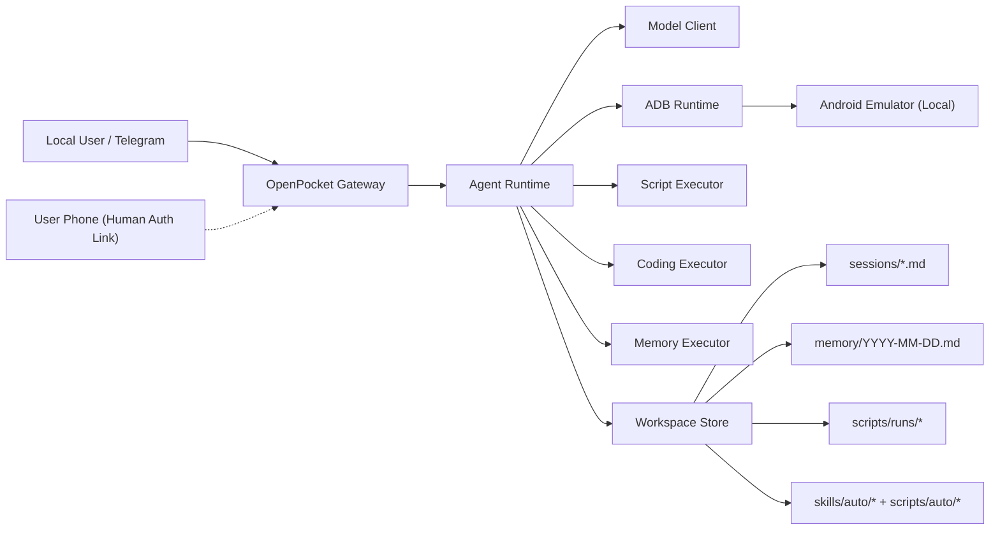

# OpenPocket

[](https://nodejs.org/)
[](https://www.typescriptlang.org/)
[](#architecture)
[](./frontend/index.md)
[](https://github.com/SergioChan/openpocket/actions/workflows/node-tests.yml)

An Intelligent Phone That Never Sleeps.  
OpenPocket runs an always-on agent phone locally, with privacy first.

## Current Capability Snapshot

Status snapshot (February 2026):

### Implemented and usable now

- Local Android emulator runtime driven by CLI + Telegram gateway + dashboard.
- Deployment target abstraction with `emulator` and `physical-phone` ready today (`android-tv` and `cloud` are in progress).
- Interactive setup (`openpocket onboard`) for consent, model/API key, Telegram, emulator boot, and human-auth mode.
- Template-driven prompt system with runtime mode control (`full|minimal|none`) and workspace context budgets.
- Bootstrap-driven chat onboarding (`BOOTSTRAP.md`, `PROFILE_ONBOARDING.json`) with persisted workspace onboarding state.
- Model-driven progress and outcome narration (`TASK_PROGRESS_REPORTER.md`, `TASK_OUTCOME_REPORTER.md`) with anti-noise suppression.
- Coding toolchain in task loop (`read`, `write`, `edit`, `apply_patch`, `exec`, `process`) with workspace/safety constraints.
- Memory tools in task loop (`memory_search`, `memory_get`) for recall-oriented interactions.
- Prompt observability via Telegram `/context [list|detail|json]`.
- Human-authorization relay (manual `/auth`, one-time web link, optional ngrok) with delegation artifact application.
- In-emulator permission dialogs auto-handled locally (no remote auth escalation for Android runtime permission popups).
- Telegram bot display-name sync from profile identity changes.
- Automatic reusable artifact generation after successful tasks (`skills/auto`, `scripts/auto`).
- Auditable persistence for sessions, daily memory, screenshots, relay state, and script run artifacts.

### Active improvement focus

- Long-horizon memory quality (ranking/compaction/freshness).
- Prompt evaluation and regression coverage for phone-use scenarios.
- Cross-platform runtime hardening and operational reliability.

## Quick Start

### 1. Prerequisites

- Node.js 20+
- Android platform-tools (`adb`) for all target types
- For default emulator target: Android SDK Emulator + at least one Android AVD
- For physical-phone target: one Android phone with Developer options + USB debugging enabled
- API key for your selected model profile (make sure you have credit with your selected model provider)
- Telegram bot token (for gateway mode) follow this [instruction](https://core.telegram.org/bots/tutorial#obtain-your-bot-token)
- (Optional, recommended) ngrok authtoken for remote approval (free to obtain)

NOTE: If `gpt-5.3-codex` is unavailable in your account/provider route, use `gpt-5.2-codex`.

### 2. Install

#### Option A: npm package (recommended for end users)

```bash
npm install -g openpocket
openpocket onboard
openpocket gateway start
```

#### Option B: source clone (recommended for contributors)

```bash
git clone git@github.com:SergioChan/openpocket.git
cd openpocket
npm install
npm run build
./openpocket onboard
./openpocket gateway start
```

### 3. What `onboard` configures

The onboarding wizard is interactive and persists progress to:

- `~/.openpocket/state/onboarding.json`

It walks through:

1. User consent for local runtime and data boundaries.
2. Model profile selection and API key source (env or local config).
3. Telegram setup (token source and chat allowlist policy).
4. Deployment target selection (`emulator`, `physical-phone`, `android-tv`, `cloud`).
5. Emulator startup and manual Play Store/Gmail verification (emulator target only).
6. Human-auth bridge mode:
   - disabled
   - local LAN relay
   - local relay + ngrok tunnel (remote approval link)

### 4. Run your first task

```bash
openpocket agent --model gpt-5.2-codex "Open Chrome and search weather"
```

Or send plain text directly to your Telegram bot after `gateway start`.

### 5. Use a physical Android phone as Agent Phone

1. Enable Developer options on your phone:
   - `Settings -> About phone -> Build number`
   - tap `Build number` 7 times
   - go back to `Settings -> System -> Developer options`
   - enable `USB debugging`
2. Connect the phone via USB and approve the `Allow USB debugging` prompt.
3. Set deployment target:

```bash
adb devices -l
openpocket target set --type physical-phone
openpocket target show
```

When multiple devices are online, `target set` shows an arrow-key selector with explicit transport labels (`USB ADB` / `WiFi ADB`) so you can choose the exact device.
You can also use aliases: `openpocket target set-target ...` or `openpocket target config ...`.

4. Start runtime:

```bash
openpocket gateway start
```

Optional Wi-Fi ADB:

```bash
adb tcpip 5555
adb connect <phone-ip>:5555
openpocket target set --type physical-phone --adb-endpoint <phone-ip>:5555
```

Notes:

- Keep phone unlocked during first pairing/authorization.
- `android-tv` and `cloud` targets already exist in config/CLI, and full deployment guides are still in progress.

### 6. Persistence and storage locations

For a full persistence map (OpenPocket runtime files + Android AVD/image storage and deletion/reset flow), see:

- [Filesystem Layout](./frontend/reference/filesystem-layout.md)
- [Session and Memory Formats](./frontend/reference/session-memory-formats.md)

## Deployment Playbook by OS

This section focuses on production-style runtime deployment for:

- `gateway start`
- emulator setup/startup
- ngrok + human-auth relay configuration

### Support Matrix

| Environment | Recommended | Notes |
| --- | --- | --- |
| macOS (Apple Silicon / Intel) | Yes | Best local developer experience. |
| Windows (native host) | Yes | Use Android Emulator on Windows host (Hyper-V/WHPX). |
| Linux Server (`x86_64` + KVM) | Yes | Recommended for headless server runtime. |
| Docker on ARM host running `linux/amd64` emulator | Not recommended | Works unpredictably due nested software emulation. |

### Common Config Baseline

Run onboarding once:

```bash
openpocket onboard
```

Or configure manually in `~/.openpocket/config.json`:

```json
{
  "target": {
    "type": "emulator",
    "adbEndpoint": "",
    "cloudProvider": ""
  },
  "emulator": {
    "avdName": "OpenPocket_AVD",
    "androidSdkRoot": "",
    "headless": true,
    "bootTimeoutSec": 180
  },
  "telegram": {
    "botTokenEnv": "TELEGRAM_BOT_TOKEN",
    "allowedChatIds": []
  },
  "humanAuth": {
    "enabled": true,
    "useLocalRelay": true,
    "localRelayHost": "127.0.0.1",
    "localRelayPort": 8787,
    "apiKeyEnv": "OPENPOCKET_HUMAN_AUTH_KEY",
    "tunnel": {
      "provider": "ngrok",
      "ngrok": {
        "enabled": true,
        "authtokenEnv": "NGROK_AUTHTOKEN"
      }
    }
  }
}
```

Required env vars for gateway + remote approval:

```bash
export TELEGRAM_BOT_TOKEN="<your_telegram_bot_token>"
export OPENPOCKET_HUMAN_AUTH_KEY="<your_human_auth_key>"
export NGROK_AUTHTOKEN="<your_ngrok_token>"
```

---

### macOS (Local Runtime)

1. Install Android SDK + Emulator + at least one AVD (Android Studio preferred).
2. Verify toolchain:

```bash
adb version
~/Library/Android/sdk/emulator/emulator -list-avds
```

3. Start emulator:

```bash
openpocket emulator start
openpocket emulator status
```

4. Start gateway (dashboard auto-starts):

```bash
openpocket gateway start
```

5. If human-auth uses ngrok, gateway will auto-start local relay + tunnel and send approval URLs in Telegram.

---

### Windows (Native Host Runtime)

Windows does not require WSL for OpenPocket runtime.
Recommended setup is: Android Emulator + adb on Windows host, OpenPocket CLI also on Windows host.

1. Install Android Studio + SDK tools, create an AVD.
2. Ensure virtualization acceleration is enabled (WHPX/Hyper-V for emulator).
3. In PowerShell:

```powershell
$env:ANDROID_SDK_ROOT="$env:LOCALAPPDATA\\Android\\Sdk"
adb version
& "$env:ANDROID_SDK_ROOT\\emulator\\emulator.exe" -list-avds
openpocket emulator start
openpocket gateway start
```

4. Set tokens in user env (or config file):

```powershell
setx TELEGRAM_BOT_TOKEN "<token>"
setx OPENPOCKET_HUMAN_AUTH_KEY "<key>"
setx NGROK_AUTHTOKEN "<ngrok_token>"
```

WSL can still be used for development tooling, but running Android Emulator inside WSL/Linux guest is not the preferred path.

---

### Linux Server (`x86_64` Headless)

This is the recommended server deployment target.

1. Validate architecture and KVM:

```bash
uname -m                # expect x86_64
ls -l /dev/kvm          # must exist
```

2. Install Android SDK cmdline tools, platform-tools, emulator, and create AVD.
3. Use headless mode in config:

```json
"emulator": {
  "headless": true,
  "extraArgs": ["-no-window", "-no-audio", "-no-boot-anim", "-no-snapshot"]
}
```

4. Start runtime:

```bash
openpocket emulator start
openpocket gateway start
```

5. For service mode, run with `systemd` or `tmux`, and keep ngrok token configured for remote human-auth links.

## Current End-to-End Tests

OpenPocket currently has two E2E paths:

1. `test/integration/docker-agent-e2e.mjs`
   - Automated agent E2E.
   - Simulates natural-language task -> planning -> emulator actions -> session assertions.
   - Can run locally (direct host execution) and in Docker wrapper (`npm run test:e2e:docker`).

2. `openpocket test permission-app run --case <scenario> --chat <chat_id>`
   - PermissionLab human-auth E2E.
   - Validates agent + Telegram + relay/ngrok + approval handoff.
   - Scenarios: `camera`, `microphone`, `location`, `contacts`, `sms`, `calendar`, `photos`, `notification`, `2fa`.

3. `scripts/smoke/dual-side-smoke.sh`
   - Dual-side smoke gate for coding + Android event lineage.
   - Covers:
     - Telegram coding instruction -> local file write verification.
     - Android build/install/run/logcat-style tool chain events.
     - Unified session trace lineage checks across tool events.
   - Runs fast with deterministic mocks and no real device dependency.

Run it locally:

```bash
bash scripts/smoke/dual-side-smoke.sh
```

## Key Capabilities

- **Local emulator-first runtime**: execution stays on your machine via adb, not a hosted cloud phone.
- **Always-on agent loop**: model-driven planning + one-step action execution over Android UI primitives.
- **Prompt system aligned for agent behavior**:
  - prompt modes (`full|minimal|none`)
  - workspace template injection with explicit char budgets
  - task progress/outcome narrators driven by prompt templates
- **Remote authorization proxy (human-auth relay)**:
  - agent emits `request_human_auth` only for real-device/sensitive checkpoints
  - gateway sends one-time approval link and manual fallback commands
  - local relay can auto-start with optional ngrok tunnel
- **In-emulator permission handling**: Android runtime permission dialogs are auto-approved locally when detected.
- **Coding and memory tools inside task loop**:
  - coding: `read`, `write`, `edit`, `apply_patch`, `exec`, `process`
  - memory: `memory_search`, `memory_get`
- **Dual control modes**: direct user control and agent control on the same emulator runtime.
- **Production-style gateway operations**: Telegram command menu bootstrap, heartbeat, cron jobs, restart loop, safe stop.
- **Script and coding safety controls**: allowlist + deny patterns + timeout + output caps + run artifacts.
- **Prompt observability**: `/context` command reports actual injected prompt context and budgets.
- **Auditable persistence**: task sessions, daily memory, screenshots, script archives, and relay/auth state.

## Roadmap

### R1. Memory System (Core Intelligence)

Build a robust memory layer for long-horizon tasks:

- semantic retrieval and episodic memory
- memory compaction/summarization
- conflict resolution and freshness policies
- memory-aware planning loops

### R2. Prompt Engineering for Phone-Use

Establish a production prompt stack tailored to mobile workflows:

- phone-specific action planning prompts
- app-state-aware prompting templates
- failure-recovery prompting
- prompt eval suite and regression benchmarks

### R3. Multi-OS Runtime and Control Surface

Expand from macOS-first to full platform support:

- Linux (Ubuntu and headless server scenarios)
- Windows support
- dashboard portability strategy:
  - primary target: local/remote Web UI
  - fallback: native OS-specific control apps only when needed

### R4. Real Device Authorization + Permission Isolation

Strengthen system-level authorization architecture:

- iOS and Android real-device compatibility
- cross-device authorization where real phone and emulator differ
- secure remote port authorization flow
- strict permission boundary between real phone and emulator runtime

### R5. Skill System Maturity

Evolve from static skills to dynamic capability generation:

- agent-authored skills/code generation
- safe execution sandbox and policy gates
- skill validation, caching, and reuse

### R6. Multi-Channel Control Integrations

Go beyond Telegram and support more communication entry points:

- international platforms: Discord, WhatsApp, iMessage, Messenger
- China-focused platforms: WeChat, QQ
- unified channel abstraction for message, auth, and task control

### R7. Account Login UX and Session Authorization

Improve real-world login workflows after app installation:

- one-time session authorization links
- 2FA and SMS code handoff UX
- low-friction human-in-the-loop checkpoints

### R8. Reliability, Security, and Release Quality (Added)

Additional engineering tracks needed for production readiness:

- end-to-end integration test matrix (including headless CI scenarios)
- threat model and security hardening for relay/auth artifacts
- observability improvements (structured logs, replay/debug traces)
- packaging/release automation and upgrade safety

## Contributor Task Board

The project is actively seeking contributors. If you want to help, pick one task area below and open a PR with the task ID in the title (for example: `R2-T3`).

### Memory System

- `R1-T1`: design memory schema v2 (episodic + semantic + working memory)
- `R1-T2`: implement memory retrieval ranking and relevance filters
- `R1-T3`: implement memory compaction/summarization jobs
- `R1-T4`: add memory quality tests for multi-step phone tasks

### Prompt Engineering

- `R2-T1`: draft phone-use prompt templates per task category (shopping/social/entertainment)
- `R2-T2`: add prompt fallback strategies for app-state ambiguity
- `R2-T3`: build prompt regression suite with golden trajectories
- `R2-T4`: add failure taxonomy and prompt tuning playbook

### Cross-Platform Runtime + Dashboard

- `R3-T1`: Linux runtime parity audit (CLI/emulator/gateway)
- `R3-T2`: Windows runtime bring-up and compatibility fixes
- `R3-T3`: define and implement Web UI dashboard MVP
- `R3-T4`: headless server operator workflow (no GUI) documentation + scripts

### Real Device Auth + Isolation

- `R4-T1`: iOS real-device auth bridge prototype
- `R4-T2`: Android real-device auth bridge hardening
- `R4-T3`: permission isolation policy and enforcement checks
- `R4-T4`: secure tunnel and one-time token lifecycle review

### Skill System

- `R5-T1`: agent-authored skill generation interface
- `R5-T2`: skill static checks + runtime policy gate
- `R5-T3`: skill test harness and reproducibility tools
- `R5-T4`: skill marketplace-style metadata/index format

### Multi-Channel Integrations

- `R6-T1`: channel abstraction layer for inbound/outbound control
- `R6-T2`: Discord connector
- `R6-T3`: WhatsApp connector
- `R6-T4`: WeChat/QQ connector research and adapter design

### Login UX + Human-in-the-Loop

- `R7-T1`: one-time account authorization session protocol
- `R7-T2`: 2FA/SMS remote approval UX flow and timeout handling
- `R7-T3`: user-facing auth status model and recovery paths
- `R7-T4`: mobile-first approval page UX improvements

### Reliability and Security

- `R8-T1`: integration test matrix for onboarding + gateway + auth relay
- `R8-T2`: security review for relay APIs and artifact storage
- `R8-T3`: observability dashboard/log schema improvements
- `R8-T4`: release pipeline hardening and rollback-safe packaging

## Product Scenarios

OpenPocket is built for both developers and everyday users.

Typical scenarios include:

- shopping flows across mobile apps
- entertainment routines and repetitive app navigation
- social task assistance with human-in-the-loop approvals
- recurring mobile actions that benefit from automation and traceability

## Runtime Flow

`Telegram / CLI -> Gateway -> Agent Runtime -> Model Client -> adb -> Android Emulator`

## Architecture



## Configuration

Primary config file:

- `~/.openpocket/config.json` (or `OPENPOCKET_HOME/config.json`)

Example config template:

- [`openpocket.config.example.json`](./openpocket.config.example.json)

Coding runtime migration note:

- `agent.legacyCodingExecutor` is now **off by default**.
- `agent.legacyCodingExecutor=true` remains available as a temporary compatibility toggle, but it is **deprecated** and will be removed.
- When fallback is disabled and a coding action is unsupported by pi coding tools, runtime errors point to this key explicitly.

### Supported Model Providers

OpenPocket supports multiple AI model providers through OpenAI-compatible APIs:

**OpenAI** - Direct access to GPT models (gpt-5.2-codex, gpt-5.3-codex)

**OpenRouter** - Multi-provider routing for Claude models (claude-sonnet-4.6, claude-opus-4.6)

**BlockRun** - Pay-per-request micropayments with no subscriptions
- Ideal for always-on agents with cost-effective pricing
- Access to 30+ models: GPT-4o, Claude Sonnet 4, Gemini 2.0 Flash, DeepSeek
- Model IDs: `blockrun/gpt-4o`, `blockrun/claude-sonnet-4`, `blockrun/gemini-2.0-flash`, `blockrun/deepseek-chat`
- Get started at [docs.blockrun.ai](https://docs.blockrun.ai)

**AutoGLM** - Phone-optimized multilingual model (autoglm-phone)

Common environment variables:

```bash
export OPENAI_API_KEY="<your_openai_key>"
export OPENROUTER_API_KEY="<your_openrouter_key>"
export BLOCKRUN_API_KEY="<your_blockrun_key>"
export AUTOGLM_API_KEY="<your_autoglm_key>"
export TELEGRAM_BOT_TOKEN="<your_telegram_bot_token>"
export OPENPOCKET_HUMAN_AUTH_KEY="<your_human_auth_relay_key>"
export NGROK_AUTHTOKEN="<your_ngrok_token>"
export ANDROID_SDK_ROOT="$HOME/Library/Android/sdk"
export OPENPOCKET_HOME="$HOME/.openpocket"
```

For Codex subscription auth (no `OPENAI_API_KEY`), OpenPocket can reuse Codex CLI credentials for codex models:

- login once with the `codex` CLI
- OpenPocket reads `$CODEX_HOME/auth.json` (or `~/.codex/auth.json`)
- on macOS, it also checks the `Codex Auth` keychain entry first

## CLI Surface

Command prefix by install mode:

- npm package install: use `openpocket ...`
- local source clone: use `./openpocket ...` (or `openpocket ...` after `install-cli`)

```bash
./openpocket --help
./openpocket install-cli
./openpocket onboard
./openpocket target show
./openpocket target set --type physical-phone
./openpocket target set --type physical-phone --adb-endpoint 192.168.1.25:5555
./openpocket config-show
./openpocket emulator start
./openpocket emulator status
./openpocket agent --model gpt-5.2-codex "Open Chrome and search weather"
./openpocket script run --text "echo hello"
./openpocket telegram setup
./openpocket telegram whoami
./openpocket skills list
./openpocket gateway start
./openpocket dashboard start
./openpocket test permission-app deploy
./openpocket test permission-app task
./openpocket human-auth-relay start
```

`human-auth-relay start` is mainly a standalone debug mode. In normal gateway usage, local relay/tunnel startup is handled automatically from config.

`gateway start` now auto-starts the local Web dashboard (default `http://127.0.0.1:51888`, configurable in `config.dashboard`).  
Use `dashboard start` when you want to run only the dashboard process.

Legacy aliases still work (deprecated): `openpocket init`, `openpocket setup`.

The legacy native macOS panel has been removed from the repository.
Use `openpocket dashboard start` (or `openpocket gateway start`, which auto-starts dashboard).

## Web Dashboard

The local Web dashboard is now the primary control surface.

### Startup behavior

1. `openpocket gateway start` auto-starts dashboard and prints dashboard URL.
2. `openpocket dashboard start` starts dashboard only (no Telegram gateway).

Default dashboard config:

```json
"dashboard": {
  "enabled": true,
  "host": "127.0.0.1",
  "port": 51888,
  "autoOpenBrowser": false
}
```

### Runtime page layout

- Left column: Gateway status, emulator controls, and core path config.
- Right column: large emulator preview pane for tap/text control.

### Auto refresh behavior

- Preview auto-refresh updates image/metadata silently.
- It does not spam status text with repeated "Refreshing emulator preview..." messages.

## Human Authorization Modes

OpenPocket supports three human-auth configurations:

1. **Disabled**: no relay, no remote approval.
2. **LAN relay**: local relay exposed on LAN for phone access in the same network.
3. **Relay + ngrok**: gateway auto-starts local relay and ngrok, then issues public approval links.

When the agent emits `request_human_auth`, Telegram users can:

- tap the web approval link
- or run fallback commands:
  - `/auth approve <request-id> [note]`
  - `/auth reject <request-id> [note]`
- for any auth wall, use the request-specific Human Auth page generated from `uiTemplate`
  (optional live remote takeover is still available), then approve/reject

### Dynamic Human Auth Portal Templates

`request_human_auth` now supports an optional `uiTemplate` payload so each authorization page can be customized per request instead of using one fixed form.

Supported template controls include:

- title/summary/capability hint text
- theme style (`brandColor`, `backgroundCss`, `fontFamily`)
- structured form fields (`text`, `textarea`, `email`, `password`, `otp`, `card-number`, `expiry`, `cvc`, `select`, ...)
- agent-generated middle-section code (`middleHtml`, `middleCss`, `middleScript`)
- agent-generated approval logic (`approveScript`)
- reusable template file path from Agent Loop coding tools (`templatePath`, JSON in workspace)
- delegation toggles (text/location/photo/audio/file attachments)
- artifact policy (`artifactKind`, `requireArtifactOnApprove`)

Portal shell invariants (always present, not generated by template):

- remote connection section (live takeover controls)
- full context section (`Show Full Context`)
- top title area
- middle input/approve area (this part is generated/customized by `uiTemplate`)

This enables capability-specific flows such as:

- OAuth login (`credentials`)
- payment card confirmation (`payment_card`)
- camera/photo delegation
- microphone/audio delegation
- location delegation
- album/file selection delegation

High-level runtime behavior:

1. agent emits `request_human_auth` with `capability` and optional `uiTemplate`
   (or `templatePath` generated via coding tools in the same Agent Loop)
2. relay renders a fixed secure shell (remote connection, context, title) plus request-specific middle/approve content from sanitized `uiTemplate`
3. human approves/rejects and optionally uploads/enters delegated artifact
4. bridge returns decision/artifact to runtime and task continues

Important: current implementation is **delegation-based** (explicit artifact handoff after approve), not direct remote hardware passthrough from human phone sensors into Agent Phone OS APIs.

Credential security notes:

- relay server and request state are hosted on the user machine
- approval artifacts are persisted locally (`state/human-auth-artifacts/`)
- no centralized OpenPocket credential relay service is used
- use LAN mode (`humanAuth.tunnel.provider=none`) for zero third-party network hop

To inspect current chat allow policy and discover recent chat IDs for your bot:

```bash
openpocket telegram whoami
```

When a running task enters Android system permission UI
(`permissioncontroller` / `packageinstaller`), OpenPocket handles it locally in
the emulator (auto-approve policy) instead of escalating to remote human-auth.

## PermissionLab E2E Test

Use the built-in Android test app to verify remote authorization flow end-to-end.

### 1) Start gateway + ngrok human-auth mode

```bash
openpocket gateway start
```

### 2) Build/install/launch test app on emulator

```bash
openpocket test permission-app deploy
```

Optional commands:

```bash
openpocket test permission-app launch
openpocket test permission-app reset
openpocket test permission-app uninstall
openpocket test permission-app cases
openpocket test permission-app task
openpocket test permission-app run --case camera --chat <your_chat_id>
openpocket test permission-app task --case camera --send --chat <your_chat_id>
```

### 3) Trigger scenario run (agent auto-clicks button)

Recommended command:

```bash
openpocket test permission-app run --case camera --chat <your_chat_id>
```

Or use `task --send` (same execution path, keeps backward compatibility):

```bash
openpocket test permission-app task --case camera --send --chat <your_chat_id>
```

Available scenario IDs: `camera`, `microphone`, `location`, `contacts`, `sms`,
`calendar`, `photos`, `notification`, `2fa`.

In this mode, OpenPocket will:

1. build/install/reset/launch PermissionLab
2. run the agent with a scenario-specific task
3. ask the agent to tap the exact scenario button
4. send Telegram only when human authorization is actually required

### 4) Approve from phone

When Telegram receives the human-auth message:

1. Open the URL button (ngrok public link).
2. Approve/reject on the web page.
3. Agent resumes and reports task result in Telegram.

## Dockerized Agent E2E (Headless Linux)

OpenPocket can run on Linux/headless servers when Android SDK + emulator dependencies are present.
The current auto-installer is macOS-only, but runtime execution is cross-platform.

For repeatable integration tests, use the Docker E2E harness:

```bash
npm run test:e2e:docker
```

What this flow does:

1. Build a Linux Docker image with Android SDK, emulator, and an AVD.
2. Start a headless emulator in the container.
3. Run OpenPocket agent with a natural-language task.
4. Verify session artifacts and action execution results.

Important notes:

- On Linux with `/dev/kvm`, emulator boot is much faster.
- On macOS Docker Desktop (no KVM passthrough), emulator usually works with software acceleration but can be significantly slower.
- You can override the task text:

```bash
OPENPOCKET_E2E_TASK=\"Open Android Settings and then go home\" npm run test:e2e:docker
```

## Documentation

### Where the frontend is

The documentation frontend is implemented in this repository:

- Site source: [`/frontend`](./frontend)
- VitePress config: [`/frontend/.vitepress/config.mjs`](./frontend/.vitepress/config.mjs)
- Custom homepage: [`/frontend/index.md`](./frontend/index.md)
- Custom theme styles: [`/frontend/.vitepress/theme/custom.css`](./frontend/.vitepress/theme/custom.css)

### Documentation Website

- Start local docs server:

```bash
npm run docs:dev
```

- Build static docs:

```bash
npm run docs:build
```

- Build for Vercel (root base path):

```bash
npm run docs:build:vercel
```

- Preview built docs:

```bash
npm run docs:preview
```

### Deployment options

- Vercel config: [`vercel.json`](./vercel.json)
- Deployment guide: [`/frontend/get-started/deploy-docs.md`](./frontend/get-started/deploy-docs.md)

### Docs entry points

- [Docs Home](./frontend/index.md)
- [Documentation Hubs](./frontend/hubs.md)
- [Get Started](./frontend/get-started/index.md)
- [Project Blueprint](./frontend/concepts/project-blueprint.md)
- [Reference](./frontend/reference/index.md)
- [Ops Runbook](./frontend/ops/runbook.md)

## Repository Structure

- [`/src`](./src): runtime source code (agent, gateway, device, tools, onboarding, dashboard)
- [`/frontend`](./frontend): standalone frontend site (homepage + docs)
- [`/test`](./test): runtime contract and integration tests
- [`/dist`](./dist): build output

## Development

Run checks:

```bash
npm run check
npm test
```

## Contributing

- Prefer behavior-driven changes with matching tests.
- Document new runtime capabilities under `/frontend` in the relevant hub.

## Security and Safety Notes

- `run_script` execution is guarded by an allowlist and deny patterns.
- `exec`/`process` coding tools are guarded by allowlist, deny patterns, workspace boundaries, timeout, and output caps.
- Timeout and output truncation are enforced for script/coding execution.
- memory tools are read-scoped to `MEMORY.md` and `memory/*.md`.
- Local paths are sanitized/redacted in Telegram-facing outputs.

## License

[MIT](./LICENSE)
