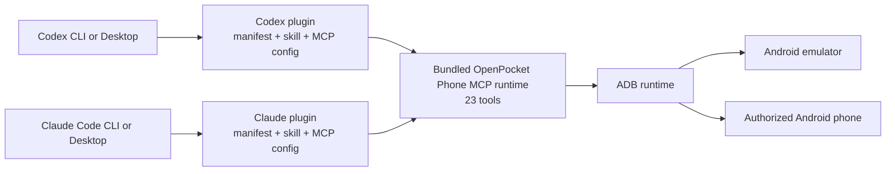
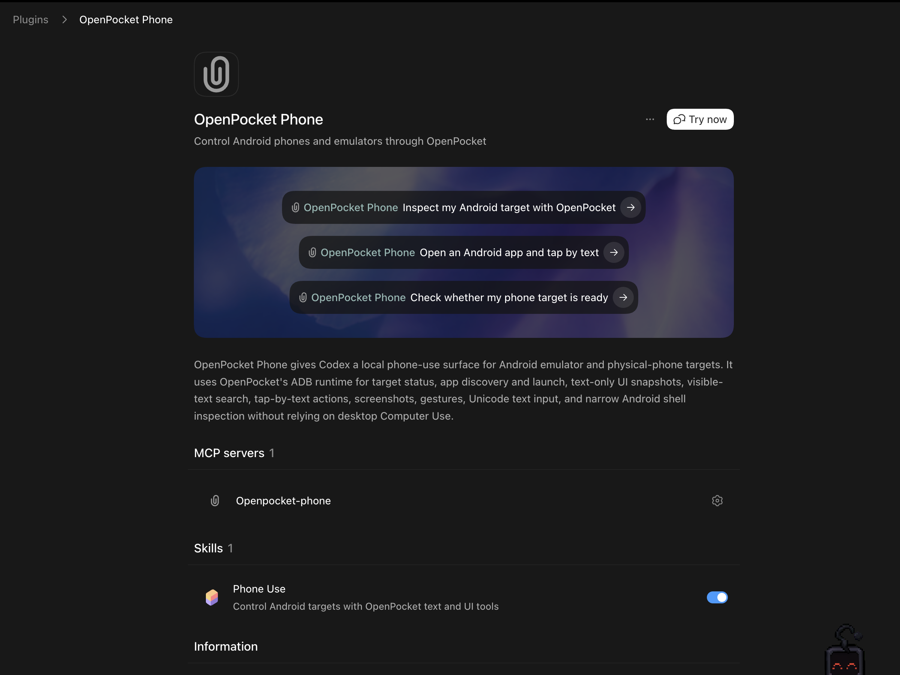

# Codex And Claude Code Phone Use

OpenPocket provides native phone-use plugins for Codex and Claude Code. Each plugin bundles host-specific metadata, a `phone-use` skill, and the same local 23-tool MCP runtime. The MCP runtime controls Android through ADB, so an agent interacts with the Android target directly instead of clicking the emulator window through desktop Computer Use.

The user-facing onboarding guide is [`plugins/openpocket-phone/README.md`](../plugins/openpocket-phone/README.md). This document describes the integration boundary, package layout, runtime behavior, and validation model.

## Integration Matrix

| Client | Native package | Installation surface |
| --- | --- | --- |
| Codex CLI | `plugins/openpocket-phone/` | `npm run phone-use:install -- codex` or `/plugins` |
| Codex Desktop | `plugins/openpocket-phone/` | `OpenPocket Local` repo marketplace in Plugins |
| Claude Code CLI | `plugins/openpocket-phone-claude/` | `npm run phone-use:install -- claude-code` |
| Claude Desktop | `plugins/openpocket-phone-claude/` | Settings > Plugins > Add > Upload plugin |

There is no root project-scoped `.mcp.json` and no required raw `claude mcp add` registration. Both hosts load a native plugin that owns its skill and MCP registration.

## Architecture



The two bundles are independent at installation time. Their generated runtime files are byte-identical and come from `src/mcp/server.ts`, but neither installed plugin needs to find `dist/mcp/server.js` in a source checkout.

## Package Boundaries

| Path | Responsibility |
| --- | --- |
| `plugins/openpocket-phone/` | Installable Codex plugin |
| `plugins/openpocket-phone/.codex-plugin/plugin.json` | Codex manifest and UI metadata |
| `plugins/openpocket-phone/.mcp.json` | Codex stdio MCP registration |
| `plugins/openpocket-phone/skills/phone-use/SKILL.md` | Codex phone-use workflow and safety guidance |
| `plugins/openpocket-phone/runtime/` | Self-contained Codex MCP runtime and Android helpers |
| `plugins/openpocket-phone-claude/` | Installable Claude Code plugin |
| `plugins/openpocket-phone-claude/.claude-plugin/plugin.json` | Claude plugin manifest |
| `plugins/openpocket-phone-claude/.mcp.json` | Claude plugin-scoped MCP registration |
| `plugins/openpocket-phone-claude/skills/phone-use/SKILL.md` | Claude phone-use workflow and safety guidance |
| `plugins/openpocket-phone-claude/runtime/` | Self-contained Claude MCP runtime and Android helpers |
| `plugins/openpocket-phone-claude/releases/openpocket-phone-claude.zip` | Ready-to-upload Claude Desktop archive |
| `.agents/plugins/marketplace.json` | Codex repo marketplace |
| `.claude-plugin/marketplace.json` | Claude Code repo marketplace |
| `src/mcp/server.ts` | Authoritative MCP implementation source |

## Installation

### CLI

Run one command from the repository root for the selected host:

```bash
npm run phone-use:install -- codex --target emulator
npm run phone-use:install -- claude-code --target emulator
```

The installer can also start the emulator:

```bash
npm run phone-use:install -- codex --target emulator --start-emulator
```

For an authorized physical Android device:

```bash
adb devices -l
npm run phone-use:install -- codex --device <serial>
npm run phone-use:install -- claude-code --device <serial>
```

### Codex Desktop

Open the repository as a Codex project, restart the app, open Plugins, select `OpenPocket Local`, and install `OpenPocket Phone`. The repo marketplace and bundled runtime make a source build unnecessary for this path.



### Claude Desktop

Open Settings > Plugins, select Add > Upload plugin, and choose [`openpocket-phone-claude.zip`](../plugins/openpocket-phone-claude/releases/openpocket-phone-claude.zip). Start a new Claude Code task after the upload.


See the [full screenshot walkthrough](../plugins/openpocket-phone/README.md#claude-desktop) for every Desktop step.

## Runtime Configuration

The plugin runtime reads `~/.openpocket/config.json`, or `$OPENPOCKET_HOME/config.json` when `OPENPOCKET_HOME` is set. If the file is missing, the runtime creates a minimal emulator-first config:

- target type: `emulator`
- AVD name: `OpenPocket_AVD`
- Android SDK root: `ANDROID_SDK_ROOT`, then `ANDROID_HOME`, then standard SDK discovery
- device ID: unset until a physical target is pinned

The native plugin does not require a model provider key in OpenPocket config. Codex or Claude supplies the agent model; OpenPocket supplies Android tools.

## Tool Surface

| Tool | Use |
| --- | --- |
| `target_status` | Inspect target type, online devices, booted devices, target resolution, and ambiguity |
| `start_emulator` | Start the configured emulator and wait for boot completion |
| `stop_emulator` | Stop the configured emulator target |
| `current_app` | Read the foreground package and lightweight visual hash |
| `screenshot` | Capture screen image content, UI metadata, visible text, secure-surface status, and metrics |
| `ui_snapshot` | Capture text-only UI metadata without image payloads |
| `visible_text` | Return visible and accessibility text with source element IDs |
| `find_text` | Match UI elements by text, content description, resource ID, or class |
| `wait_for_text` | Poll for a matching UI state |
| `tap_text` | Tap the best text or resource-ID match |
| `tap` | Tap raw device coordinates |
| `tap_element` | Tap an element ID returned by an inspection tool |
| `swipe` | Perform a swipe gesture |
| `drag` | Drag between two points |
| `long_press_drag` | Long-press and drag between two points |
| `type_text` | Enter Unicode text through the OpenPocket IME helper |
| `key_event` | Send Android key events such as BACK, HOME, ENTER, or SEARCH |
| `open_app` | Open an app by launcher label or package name |
| `launch_app` | Launch an app by exact package name |
| `adb_shell` | Run narrow Android shell inspection commands |
| `list_apps` | List launchable app labels and package names |
| `list_packages` | List launchable package names |
| `wait` | Pause between actions |

The expected interaction order is:

1. `target_status`
2. `ui_snapshot`, `visible_text`, or `current_app`
3. `find_text` or `wait_for_text`
4. `tap_text` or `tap_element`
5. raw `tap` only when UI metadata is unavailable

## Native Validation

Do not treat a visible skill as proof that the plugin MCP server loaded. Validate three distinct layers:

1. **Package**: the host accepts the plugin manifest and sees one `phone-use` skill.
2. **Protocol**: the bundled server completes MCP initialization and returns all 23 tools from `tools/list`.
3. **Fresh host session**: a newly started Codex or Claude Code task can call `target_status` without manually starting `dist/mcp/server.js`.

Use this acceptance prompt:

```text
Use OpenPocket Phone only. Call target_status and report targetType, avdName,
devices, bootedDevices, resolvedDeviceId, resolveError, and ambiguousTarget.
Then call current_app and ui_snapshot without tapping or typing.
```

Run package-level checks from the repository root:

```bash
npm run phone-use:package
node plugins/openpocket-phone/scripts/doctor.mjs
claude plugin validate plugins/openpocket-phone-claude --strict
node --test test/codex-phone-plugin.test.mjs test/claude-phone-plugin.test.mjs
```

## Safety Boundaries

The plugin can drive the authorized Android target. Agents should pause for explicit user confirmation before:

- purchases, payments, bids, or financial submissions
- messages, posts, likes, follows, or other external communication
- account, security, privacy, or payment-setting changes
- password, OTP, recovery-code, card, government-ID, or private health and finance entry
- camera, microphone, photos, contacts, files, location, biometric, NFC, or SMS access

OpenPocket does not bypass ADB authorization, Android trust prompts, lock screens, secure surfaces, or application security controls.

## Development Workflow

Rebuild both generated runtimes and the Claude archive:

```bash
npm install
npm run phone-use:package
```

The package script writes the Claude runtime, copies the same files into the Codex plugin, and rebuilds the upload zip. A Codex plugin content change must also bump the build metadata in `plugins/openpocket-phone/.codex-plugin/plugin.json` so existing hosts do not retain a stale cache entry.

## Troubleshooting

### Skill Present, Tools Missing

Start a new host session. Tool registries are session-scoped, so an already running task does not gain newly installed plugin MCP tools.

### Plugin Runtime Does Not Start

Confirm Node.js 20 or newer is visible to the desktop process, then run:

```bash
node --version
node plugins/openpocket-phone/scripts/doctor.mjs
```

### ADB Target Does Not Resolve

Run `adb devices -l`, call `target_status`, and set an explicit physical `deviceId` when multiple targets are online.

### Emulator Does Not Start

Confirm `emulator.avdName` in `~/.openpocket/config.json` matches an installed AVD and that `ANDROID_SDK_ROOT` points to the intended Android SDK.
