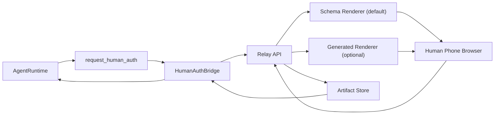

# Human Auth Dynamic Portal and Capability Relay Architecture

## Goal

Allow `request_human_auth` to render request-specific authorization pages instead of a fixed portal,
while keeping approval and delegated artifacts local-first and auditable.

## Current Implemented Layer

OpenPocket now supports dynamic portal rendering driven by `uiTemplate`:

- fixed secure shell sections (remote connection controls, context, title)
- per-request override (`title`, `summary`, `style`, `fields`, attachment toggles)
- agent-authored middle/approve code (`middleHtml`, `middleCss`, `middleScript`, `approveScript`)
- artifact policy (`artifactKind`, `requireArtifactOnApprove`)

This gives immediate flexibility for login, payment, media, and custom form collection without shipping a new hardcoded capability page for every case.

## Feasibility Assessment

### 1) Dynamic auth page generation from agent requests

Feasible now and implemented.

- transport already exists (`request_human_auth` -> bridge -> relay)
- relay can safely sanitize and render dynamic schema
- approved payload returns as a typed artifact for runtime application

### 2) Reusable template registry

Feasible with low risk.

Recommended next layer:

- add `templateId + templateVersion`
- persist template specs under local state (e.g. `state/human-auth-templates/`)
- allow runtime to reuse the same template by id without regenerating fields each time

### 3) Agent-authored page code generation (coding agent)

Feasible with guardrails.

Recommended architecture:

- treat generated page code as a plugin renderer behind a strict sandbox contract
- base renderer remains schema-driven fallback
- generated code can only receive whitelisted request payload, no raw local secrets
- generated output must pass static checks (size, forbidden APIs, CSP-compatible)

### 4) Human Phone hardware passthrough (camera/mic/location/album)

Partially feasible, but should be phased.

- **Immediate safe model (implemented):** approval + artifact delegation
  - Human Phone captures/chooses data
  - relay returns artifact to Agent Phone runtime
- **Future advanced model:** live capability streaming (for example WebRTC bridge)
  - higher complexity: latency, reliability, trust model, attack surface
  - should be isolated as a separate capability provider layer, not mixed with basic auth portal

## Recommended Target Architecture

## Security and Compliance Constraints

- Always sanitize template fields and style values.
- Enforce `requireArtifactOnApprove` on both client and relay server.
- Keep request state and artifacts local (`state/human-auth-relay/`, `state/human-auth-artifacts/`).
- Keep one-time token model for open/poll channels.
- Never allow generated portal code to access unrestricted filesystem or process APIs.

## Suggested Next Milestones

1. Template registry + versioning
2. Renderer selection (`schema` vs `generated`) with fallback
3. Template lint + security validation pipeline
4. Capability provider abstraction for future Human Phone live resource relay
5. E2E suite for payment/card, media delegation, and custom template scenarios
