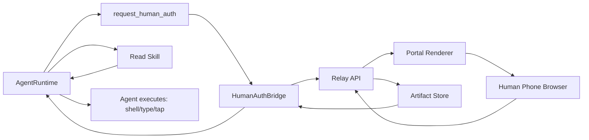

# Human Auth Dynamic Portal and Capability Relay Architecture

## Goal

Allow `request_human_auth` to render request-specific authorization pages instead of a fixed portal,
while keeping approval and delegated artifacts local-first and auditable.

Post-approval artifact handling is fully **agentic** — the runtime describes artifacts to the Agent,
and the Agent decides how to apply them guided by capability-specific Skills.

## Current Implemented Layers

### 1) Dynamic Portal Rendering

OpenPocket supports dynamic portal rendering driven by `uiTemplate`:

- fixed secure shell sections (remote connection controls, context, title)
- per-request override (`title`, `summary`, `style`, `fields`, attachment toggles)
- agent-authored middle/approve code (`middleHtml`, `middleCss`, `middleScript`, `approveScript`)
- native Agent Loop path: coding tools can generate JSON template files and pass `templatePath`
- artifact policy (`artifactKind`, `requireArtifactOnApprove`)

Portal security:

- CSP meta tag restricts all network requests to same-origin
- `middleScript`/`approveScript` run via `new Function()` with synchronous API contract
- one-time token model; token not exposed to custom scripts

### 2) Agentic Delegation (Skill-Driven)

After human approval, the runtime does NOT auto-apply artifacts. Instead:

1. Artifact is saved to `state/human-auth-artifacts/`.
2. `describeArtifact()` generates a structured summary (kind, size, fields, sensitivity flags).
3. Summary is returned to the Agent as tool result text.
4. Agent reads the relevant Human Auth Skill and decides what to do.

**Sensitive data protection:** OTP/verification code values are NOT included in the description or session logs. Only `value_length=N` is recorded. The Agent reads actual values from the artifact file.

### 3) Capability Probe (System-Level Detection)

`PhoneUseCapabilityProbe` monitors ADB signals (appops, camera service, logcat activity intents) to detect when apps on Agent Phone request hardware capabilities (camera, microphone, location, photos).

When detected, the runtime automatically:
- Constructs an appropriate `uiTemplate` based on the detected capability type
- Sends a Human Auth request to the human

This is a **system-level safety mechanism** — it runs before the Agent has a chance to react, ensuring sensitive hardware access is always gated through human authorization. The template construction uses a simple mapping (camera → photo attachment, microphone → audio attachment, etc.) which is intentionally hardcoded infrastructure, not agent decision logic.

### 4) SSE Decision Notification

The relay server supports Server-Sent Events for instant decision notification:

- `GET /v1/human-auth/requests/:id/events?pollToken=...`
- Sends `event: decision` with full payload when resolved
- 15-second keepalive with proactive timeout checking
- Bridge tries SSE first, falls back to traditional polling

## Human Auth Skills

Each capability has a dedicated Skill file in `skills/human-auth-*/SKILL.md`:

```
skills/
  human-auth-delegation/SKILL.md   # Overview and artifact type reference
  human-auth-camera/SKILL.md       # Photo capture → push → picker flow
  human-auth-photos/SKILL.md       # Album selection (single + multi)
  human-auth-microphone/SKILL.md   # Audio recording → push → file picker
  human-auth-location/SKILL.md     # GPS injection (emulator) / manual input (device)
  human-auth-oauth/SKILL.md        # Credential reading → login form fill
  human-auth-payment/SKILL.md      # Card field reading → checkout form fill
  human-auth-sms-2fa/SKILL.md      # OTP code reading → verification input
  human-auth-qr/SKILL.md           # QR scan result handling
  human-auth-nfc/SKILL.md          # NFC/RFID data handling
  human-auth-biometric/SKILL.md    # Biometric auth + PIN fallback
  human-auth-contacts-data/SKILL.md # Contacts/calendar/file import
```

Skills are discovered by `SkillLoader` and appear in the Agent's `<available_skills>` context. The Agent can `read()` any skill for detailed instructions.

**Adding new capabilities requires only a new Skill markdown file** — no TypeScript code changes.

## Architecture



## Security and Compliance Constraints

- Always sanitize template fields and style values.
- Enforce `requireArtifactOnApprove` on both client and relay server.
- Keep request state and artifacts local (`state/human-auth-relay/`, `state/human-auth-artifacts/`).
- Keep one-time token model for open/poll channels.
- CSP restricts portal page network access to same-origin.
- OTP/code values are not written to session logs (only length).
- Skills instruct Agent to delete sensitive artifacts (credentials, payment) after use.
- Artifact size limit: 20MB base64.

## Suggested Next Milestones

1. Template registry + versioning for reusable portal layouts
2. WebRTC capability provider for live camera/microphone streaming (future layer)
3. E2E test suite covering all 12 Human Auth Skills
4. Skill contribution guide for open-source contributors
