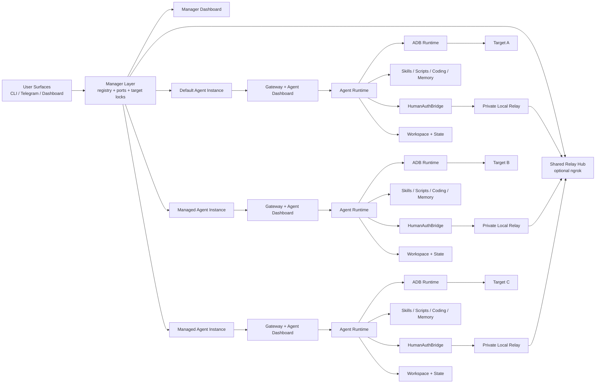

# Architecture

OpenPocket is a local-first phone-use runtime: automation runs against configurable local Agent Phone targets, and state remains auditable on disk.

A single install can host one default agent plus many managed agents. Each agent remains a **single-target runtime**.

## End-to-End Topology

## Runtime Planes

- Manager plane: agent registry, model template capture, manager ports, target exclusivity locks, manager dashboard, shared relay hub.
- Agent instance plane: one config, one workspace, one state, one gateway, one dashboard, one selected target.
- Intelligence plane: `AgentRuntime` + `ModelClient` for one-step multimodal decisions.
- Prompt/context plane: workspace templates + skills + `/context` diagnostics.
- Extensibility plane: `SkillLoader`, `ScriptExecutor`, `CodingExecutor`, `MemoryExecutor`.
- Capability plane: `PhoneUseCapabilityProbe` for camera/microphone/location/photos/payment signal detection.
- Execution plane: `AdbRuntime` drives the selected target and captures snapshots.
- Persistence plane: sessions, memory, screenshots, onboarding state, and generated artifacts.
- Human-auth plane: `HumanAuthBridge` + relay/tunnel for remote approval/delegation handoff.

## Multi-Agent Runtime Model

OpenPocket does **not** implement one agent controlling multiple targets simultaneously.

Instead, it implements:

- one install
- many isolated agent instances
- one selected target per agent instance

This keeps these boundaries simple and auditable:

- workspace and session continuity remain agent-local
- channel state remains agent-local
- target binding remains exclusive
- gateway busy/locks remain agent-local

## Deployment Targets

- `emulator`: default onboarding path and fully documented
- `physical-phone`: USB + Wi-Fi ADB path, ready for daily usage
- `android-tv`: type and baseline flow available, broader hardening in progress
- `cloud`: type/config placeholder exists, provider integrations in progress

Target rules:

- switching target is explicit via `openpocket target set ...`
- managed agents use `openpocket --agent <id> target set ...`
- the selected agent gateway must be stopped before target changes
- two agents cannot bind or run against the same target fingerprint

## Primary Task Loop

1. Receive task from CLI, channel, or cron.
2. Select one agent config/workspace/state context.
3. Create session context and resolve model profile/auth.
4. Capture screen snapshot and call model for exactly one normalized action.
5. Execute action by target executor:
   - `AdbRuntime` for phone actions
   - `ScriptExecutor` for `run_script`
   - `CodingExecutor` for file/shell/process tools
   - `MemoryExecutor` for memory tools
6. Run capability probe checks around interactive actions and optionally escalate to Human Auth.
7. Persist step thought/action/result and optional screenshot.
8. Emit selective progress narration through the selected gateway.
9. Stop on `finish`, max steps, error, or explicit stop.
10. Finalize session, append daily memory, and generate reusable artifacts on success.

## Manager Services

### Manager dashboard

The manager dashboard is an install-level overview that shows:

- all registered agents
- per-agent target binding
- configured channels
- gateway running state
- links to each agent dashboard

### Shared relay hub

The relay hub is also install-level:

- managed agents register their private local relay endpoints to it
- one optional ngrok public URL can be reused across agents
- requests are routed by `/a/<agentId>/...`
- actual request state/artifacts stay inside the target agent's state directory

## Permission and Human Auth Boundary

- Android runtime permission dialogs inside Agent Phone are handled locally by policy.
- `request_human_auth` is for real-world sensitive checkpoints (OTP, camera, microphone, payment, OAuth, delegated files/data).
- In agentic delegation mode, runtime stores/describes artifacts; the agent decides how to apply them using capability skills.

## Auto Skill Experience Engine

On successful runs, `AutoArtifactBuilder` can produce:

- `workspace/skills/auto/*.md` (behavior fingerprint + semantic UI target traces)
- `workspace/scripts/auto/*.sh` (replay script from deterministic steps)

At inference time, `SkillLoader` injects:

- summarized skill catalog with names, descriptions, and file locations
- requirement-gated skill discovery only; the model must `read(location)` to load a skill body on demand

This remains scoped to one agent workspace. Auto-generated experience is not shared across agents.

## Model Endpoint Compatibility

Endpoint fallback order:

- task loop (`ModelClient`): `chat` -> `responses`
- chat assistant (`ChatAssistant`): `responses` -> `chat` -> `completions`

This keeps provider compatibility high without changing user workflow.

## Why This Shape

- no hosted cloud phone runtime required
- device control and artifacts stay local
- users can choose emulator for convenience or physical phone for production-like behavior
- multiple isolated agents can coexist without corrupting each other's workspace or target state
- one shared relay entry can still serve many agents when free ngrok limits force a single public URL
