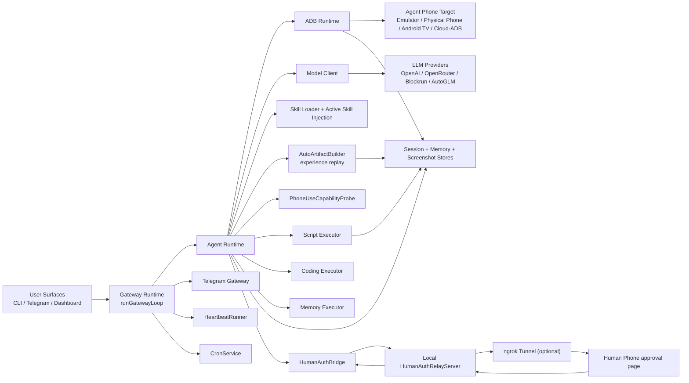

# Architecture

OpenPocket is a local-first phone-use runtime: automation runs against a configurable local Agent Phone target, and state remains auditable on disk.

## End-to-End Topology

## Runtime Planes

- Control plane: `runGatewayLoop`, `TelegramGateway`, `HeartbeatRunner`, `CronService`.
- Local control surface: `DashboardServer` for runtime status and control APIs.
- Intelligence plane: `AgentRuntime` + `ModelClient` for one-step multimodal decisions.
- Prompt/context plane: workspace templates + skills + `/context` diagnostics.
- Extensibility plane: `SkillLoader`, `ScriptExecutor`, `CodingExecutor`, `MemoryExecutor`.
- Capability plane: `PhoneUseCapabilityProbe` for camera/microphone/location/photos/payment signal detection.
- Execution plane: `AdbRuntime` drives the selected target and captures snapshots.
- Persistence plane: sessions, memory, screenshots, onboarding state, and generated artifacts.
- Human-auth plane: `HumanAuthBridge` + relay/tunnel for remote approval/delegation handoff.

## Deployment Targets

- `emulator`: default onboarding path and fully documented.
- `physical-phone`: USB + Wi-Fi ADB path, ready for daily usage.
- `android-tv`: type and baseline flow available, broader hardening in progress.
- `cloud`: type/config placeholder exists, provider integrations in progress.

Target switching is explicit and reversible via `openpocket target set ...` and `openpocket target pair ...` (for Wi-Fi pairing flows).

## Primary Task Loop

1. Receive task from CLI, Telegram, or cron.
2. Create session context and resolve model profile/auth.
3. Capture screen snapshot and call model for exactly one normalized action.
4. Execute action by target executor:
   - `AdbRuntime` for phone actions
   - `ScriptExecutor` for `run_script`
   - `CodingExecutor` for file/shell/process tools
   - `MemoryExecutor` for memory tools
5. Run capability probe checks around interactive actions and optionally escalate to Human Auth.
6. Persist step thought/action/result and optional screenshot.
7. Emit selective progress narration through chat assistant.
8. Stop on `finish`, max steps, error, or explicit stop.
9. Finalize session, append daily memory, and generate reusable artifacts on success.

## Permission and Human Auth Boundary

- Android runtime permission dialogs inside Agent Phone are handled locally by policy.
- `request_human_auth` is for real-world sensitive checkpoints (OTP, camera, microphone, payment, OAuth, delegated files/data).
- In agentic delegation mode, runtime stores/describes artifacts; the agent decides how to apply them using capability skills.

## Auto Skill Experience Engine

On successful runs, `AutoArtifactBuilder` can produce:

- `workspace/skills/auto/*.md` (behavior fingerprint + semantic UI target traces)
- `workspace/scripts/auto/*.sh` (replay script from deterministic steps)

At inference time, `SkillLoader` injects:

- summarized skill catalog
- active skill blocks selected by task/app/trace relevance with metadata gating

This creates a lightweight experience-replay loop without hardcoded case routing.

## Model Endpoint Compatibility

Endpoint fallback order:

- task loop (`ModelClient`): `chat` -> `responses`
- chat assistant (`ChatAssistant`): `responses` -> `chat` -> `completions`

This keeps provider compatibility high without changing user workflow.

## Why Local Device Runtime

- No hosted cloud phone runtime required.
- Device control and artifacts stay local.
- Users can choose emulator for convenience or physical phone for production-like behavior.
- Human and agent can hand off control on the same target session.
