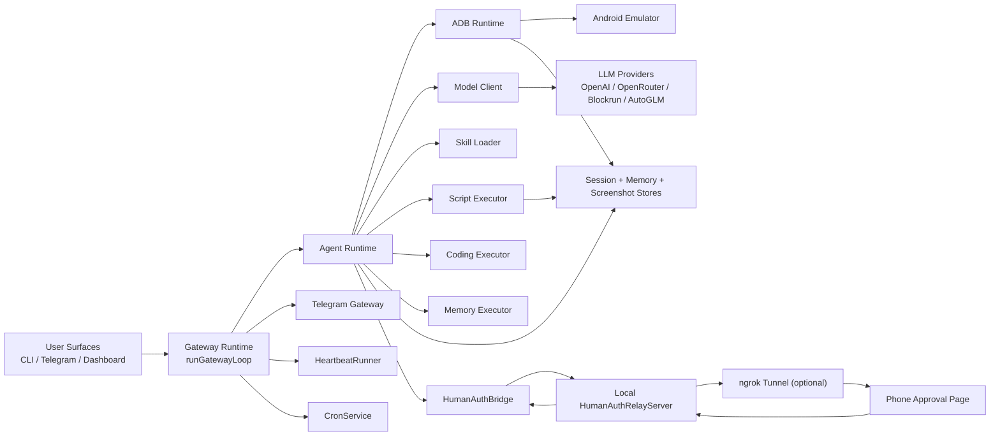

# Architecture

OpenPocket is a local-first phone-use runtime: automation runs on a local Android emulator and state remains auditable on disk.

## End-to-End Topology

## Runtime Planes

- Control plane: `runGatewayLoop`, `TelegramGateway`, `HeartbeatRunner`, `CronService`.
- Local control surface: `DashboardServer` for runtime status and control APIs.
- Intelligence plane: `AgentRuntime` + `ModelClient` for one-step multimodal decisions.
- Prompt/context plane: workspace templates + skills + `/context` diagnostics.
- Extensibility plane: `SkillLoader`, `ScriptExecutor`, `CodingExecutor`, `MemoryExecutor`.
- Execution plane: `AdbRuntime` drives emulator and captures snapshots.
- Persistence plane: sessions, memory, screenshots, onboarding state, and generated artifacts.
- Human-auth plane: `HumanAuthBridge` + relay/tunnel for remote approval handoff.

## Primary Task Loop

1. Receive task from CLI, Telegram, or cron.
2. Create session context and resolve model profile/auth.
3. Capture screen snapshot and call model for exactly one normalized action.
4. Execute action by target executor:
   - `AdbRuntime` for phone actions
   - `ScriptExecutor` for `run_script`
   - `CodingExecutor` for file/shell/process tools
   - `MemoryExecutor` for memory tools
5. Persist step thought/action/result and optional screenshot.
6. Emit selective progress narration through chat assistant.
7. Stop on `finish`, max steps, error, or explicit stop.
8. Finalize session, append daily memory, and generate reusable artifacts on success.

## Permission and Human Auth Boundary

- In-emulator Android runtime permission dialogs are auto-approved locally.
- `request_human_auth` is for real-device/sensitive checkpoints (OTP, camera capture, biometric-like approvals, payments, etc.).

This keeps routine emulator permissions inside the VM loop and reserves human interruption for real authorization needs.

## Model Endpoint Compatibility

Endpoint fallback order:

- task loop (`ModelClient`): `chat` -> `responses`
- chat assistant (`ChatAssistant`): `responses` -> `chat` -> `completions`

This keeps provider compatibility high without changing user workflow.

## Why Local Emulator

- No hosted cloud phone runtime required.
- Device control and artifacts stay local.
- Human and agent can hand off control on the same emulator session.
