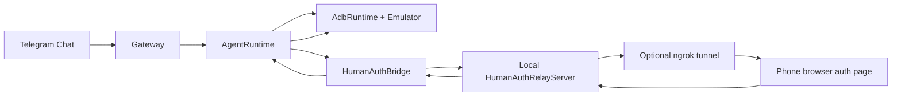
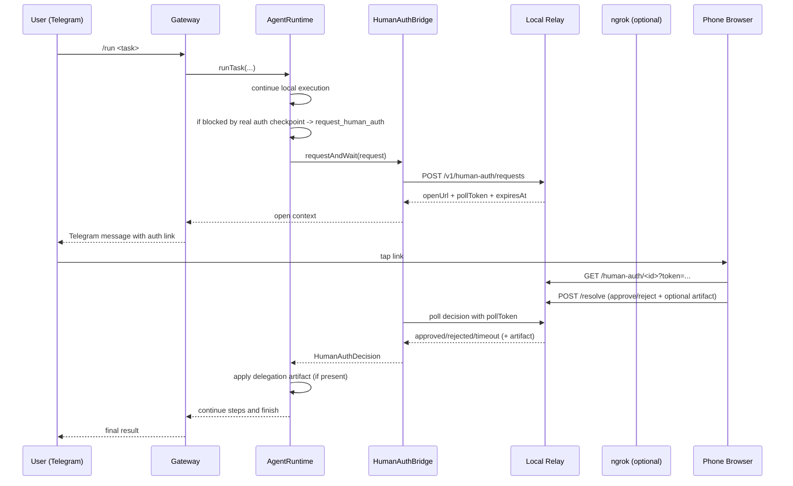

# Remote Human Authorization

This page documents the implemented authorization and delegation system used by OpenPocket today.

Design goal:

- keep long-running automation inside local emulator task loop
- ask user on phone only when true real-world authorization/data is required
- resume VM flow with auditable, scoped delegation

## Boundary Policy

### Handled locally in emulator (no human auth)

- Android runtime permission dialogs inside emulator (`permissioncontroller`, `packageinstaller`)
- runtime auto-detects and taps allow/reject target based on policy

### Escalated to human auth

- real-device/sensitive checkpoints (OTP, camera capture, biometric-like approval, payment, OAuth, etc.)
- any step where model explicitly emits `request_human_auth`

## Why This Exists

Some flows cannot be completed from emulator-only UI automation:

- identity checks (2FA, OTP)
- real-world inputs (camera image, QR payload, live location)
- policy-gated confirmation steps

OpenPocket handles this with split architecture:

- VM side: continuous autonomous execution
- phone side: explicit authorization + optional delegation artifact

## Architecture



## End-to-End Sequence



## Request and Token Model

Each request has:

- `requestId`
- `openToken` (phone web page token)
- `pollToken` (runtime polling token)
- `expiresAt`
- immutable context (`task`, `sessionId`, `step`, `capability`, `instruction`, `currentApp`)

Security characteristics:

- one-time scoped open token hash
- separate poll token hash
- timeout auto-resolution (`pending -> timeout`)
- optional relay API bearer auth (`humanAuth.apiKey` / `humanAuth.apiKeyEnv`)

## Delegation Artifact Types

Remote approval may include optional artifact payload.

| Capability | Typical payload from phone | Runtime apply behavior |
| --- | --- | --- |
| `sms`, `2fa`, `qr`, `oauth`, `payment`, `biometric`, `notification`, `contacts`, `calendar`, `files`, `permission`, `unknown` | JSON `{ kind: "text" \| "qr_text", value }` | Auto `type` into focused input field |
| `location` | JSON `{ kind: "geo", lat, lon }` | `adb emu geo fix <lon> <lat>` |
| `camera`, `microphone`, `voice`, `nfc` (or image path) | Image file (`.jpg/.png/.webp`) | Push to `/sdcard/Download/openpocket-human-auth-<ts>.<ext>` |

After image injection, runtime may append deterministic hint in history:

- `delegation_template=gallery_import_template: ...`

So the next model step can follow stable upload flow (open picker -> Downloads -> select file -> confirm).

## Relay Modes

### Local relay only (LAN)

- `humanAuth.useLocalRelay=true`
- `humanAuth.tunnel.provider=none`
- phone must reach local network address

### Local relay + ngrok (remote phone)

- `humanAuth.useLocalRelay=true`
- `humanAuth.tunnel.provider=ngrok`
- `humanAuth.tunnel.ngrok.enabled=true`
- `NGROK_AUTHTOKEN` (or config token) configured

Gateway startup auto-brings relay/tunnel up when enabled.

## Telegram Integration

When blocked by auth checkpoint:

- gateway sends request summary
- includes one-tap link when available
- manual fallback commands always available:
  - `/auth pending`
  - `/auth approve <request-id> [note]`
  - `/auth reject <request-id> [note]`

For `sms`/`2fa`, plain code reply (4-10 digits) can resolve pending request directly.

## Test Methodology

### 1) Preflight

```bash
openpocket config-show
openpocket telegram whoami
openpocket emulator status
openpocket gateway start
```

Checkpoints:

- Telegram token valid and target chat allowed
- emulator booted device exists
- gateway logs show relay/tunnel readiness (if enabled)

### 2) List PermissionLab scenarios

```bash
openpocket test permission-app cases
```

Expected IDs:

- `camera`, `microphone`, `location`, `contacts`, `sms`, `calendar`, `photos`, `notification`, `2fa`

### 3) Run full E2E scenario

```bash
openpocket test permission-app run --case camera --chat <telegram_chat_id>
```

Expected:

1. PermissionLab deploy/install/reset/launch
2. agent taps scenario button
3. if scenario requires remote authorization, agent calls `request_human_auth`
4. Telegram receives auth request/link
5. user approves/rejects
6. agent resumes and reports outcome

### 4) Validate delegation application

Inspect latest session file and verify lines:

- `Human auth approved|rejected|timeout request_id=...`
- optional `human_artifact=...`
- optional `delegation_result=...`
- optional `delegation_template=...`

### 5) Failure drills

Simulate faults:

- stop ngrok tunnel
- reject request
- let request timeout

Expected:

- task does not hang forever
- decision appears in session + Telegram
- manual `/auth` commands still work

## Operational Observability

Primary artifacts:

- relay request state: `state/human-auth-relay/requests.json`
- uploaded artifacts: `state/human-auth-artifacts/`
- task trace: `workspace/sessions/session-*.md`
- gateway logs containing `[OpenPocket][human-auth]`

## Current Limits

- browser permission behavior differs by Telegram in-app browser and mobile OS
- some app-specific post-delegation flows still require stronger skill guidance
- ngrok free tier allows only one active session; duplicates can break link generation
