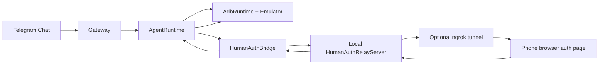
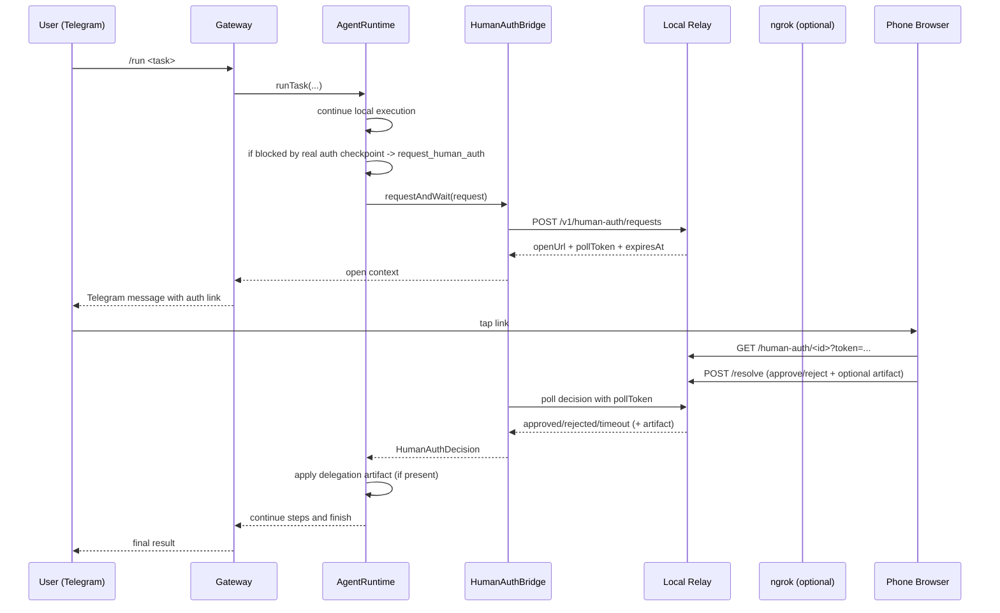
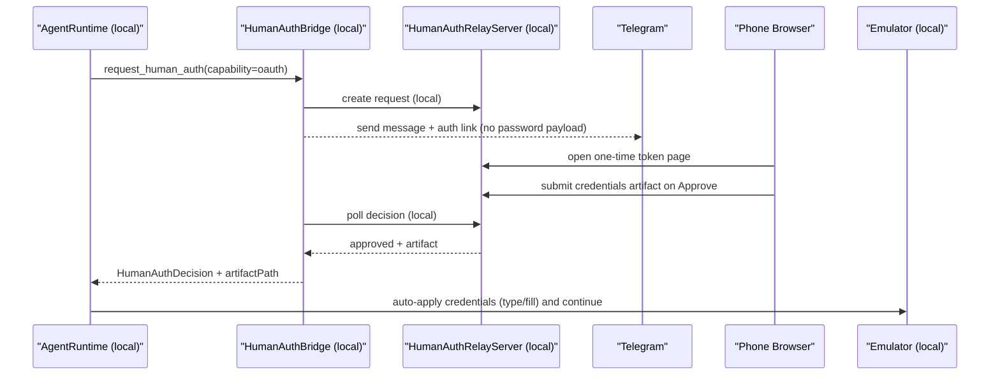

# Remote Human Authorization

This page documents the implemented authorization and delegation system used by OpenPocket today.

Design goal:

- keep long-running automation inside local emulator task loop
- ask user on phone only when true real-world authorization/data is required
- resume VM flow with auditable, scoped delegation

## Boundary Policy

### Handled locally in emulator (no human auth)

- Android runtime permission dialogs inside emulator (`permissioncontroller`, `packageinstaller`)
- runtime auto-detects and taps allow/reject target based on policy

### Escalated to human auth

- real-device/sensitive checkpoints (OTP, camera capture, biometric-like approval, payment, OAuth, etc.)
- any step where model explicitly emits `request_human_auth`

## Template-Driven Human Auth Portal

Human Auth pages are no longer fixed to one hardcoded layout.
`request_human_auth` can include an optional `uiTemplate` object, and relay renders each request page from:

- a fixed secure shell (top title, remote takeover section, full context section)
- plus sanitized per-request middle/approve customization from agent

Template controls can define:

- dynamic title/summary/hint
- form schema (custom fields and validation)
- style variables (brand/background/font)
- agent-generated middle section (`middleHtml`, `middleCss`, `middleScript`)
- agent-generated approve hook (`approveScript`)
- reusable template file path from Agent Loop coding flow (`templatePath`, JSON in workspace)
- allowed attachment channels (text/location/photo/audio/file)
- artifact policy (`artifactKind`, `requireArtifactOnApprove`)

Shell invariants (always rendered by relay, not delegated to custom template code):

- remote connection section (live takeover)
- full context section
- top title section
- customizable middle input/approve section

This supports scenario-specific auth UX, for example:

- account login page with dedicated credentials form
- payment page with card number / expiry / cvc
- album delegation page asking user to pick media from Human Phone
- location-only page requiring coordinates before approval

## Why This Exists

Some flows cannot be completed from emulator-only UI automation:

- identity checks (2FA, OTP)
- real-world inputs (camera image, QR payload, live location)
- policy-gated confirmation steps

OpenPocket handles this with split architecture:

- VM side: continuous autonomous execution
- phone side: explicit authorization + optional delegation artifact

## Architecture



## End-to-End Sequence



## Request and Token Model

Each request has:

- `requestId`
- `openToken` (phone web page token)
- `pollToken` (runtime polling token)
- `expiresAt`
- immutable context (`task`, `sessionId`, `step`, `capability`, `instruction`, `currentApp`)

Security characteristics:

- one-time scoped open token hash
- separate poll token hash
- timeout auto-resolution (`pending -> timeout`)
- optional relay API bearer auth (`humanAuth.apiKey` / `humanAuth.apiKeyEnv`)

## Credential Login Flow (OAuth / Username+Password)

This is the critical privacy path for account login walls.

### User Experience (what user sees)

1. Agent reaches login wall in emulator app and emits `request_human_auth` with `capability=oauth`.
2. Telegram receives a one-tap auth link.
3. Phone opens Human Auth page with:
   - dedicated `Username / Email` and `Password` inputs
   - `Approve` / `Reject`
   - optional `Decision Note`
   - optional live `Remote Takeover` (stream + control) if user wants direct emulator control
4. User can either:
   - enter credentials in the dedicated form and tap `Approve` (recommended), or
   - use remote takeover to type directly inside emulator, then approve/reject.
5. Agent resumes and continues login flow in emulator.

### Credential Data Path (exact channels)



### Hosting, Transport, and Storage Guarantees

| Stage | Where it runs | Transport channel | Persistent storage |
| --- | --- | --- | --- |
| Request creation/polling | User local machine (`Gateway` + `HumanAuthBridge` + `Relay`) | Loopback/local network | `state/human-auth-relay/requests.json` (local) |
| Credential form handling | User local relay server | Browser -> local relay (LAN mode), or browser -> TLS ngrok tunnel -> local relay (ngrok mode) | same local state file |
| Credential artifact bytes | User local relay + bridge | same channel as above | `state/human-auth-artifacts/<requestId>.json` (local) |
| Runtime apply to app | User local machine (`AgentRuntime` + `adb`) | local process + adb | session trace under `workspace/sessions/` |

Security boundary:

- OpenPocket does **not** use a centralized OpenPocket credential relay service.
- Relay server and artifact storage are on the user machine.
- For strict zero-third-party network hop, use LAN mode (`humanAuth.tunnel.provider=none`).
- In ngrok mode, ngrok is transport only; OpenPocket runtime/state/artifacts still stay local.
- Current model is explicit approval + artifact delegation from Human Phone, not direct OS-level hardware passthrough into Agent Phone APIs.

## Delegation Artifact Types

Remote approval may include optional artifact payload.

| Capability | Typical payload from phone | Runtime apply behavior |
| --- | --- | --- |
| `sms`, `2fa`, `qr`, `biometric`, `notification`, `contacts`, `calendar`, `permission`, `unknown` | JSON `{ kind: "text" \| "qr_text", value }` | Auto `type` into focused input field |
| `oauth` | JSON `{ kind: "credentials", username, password }` or template-form JSON | Auto apply credentials / fields into current login flow |
| `payment` | JSON `{ kind: "payment_card", fields... }` | Agent uses delegated card fields in checkout flow |
| `location` | JSON `{ kind: "geo", lat, lon }` | `adb emu geo fix <lon> <lat>` |
| `camera`, `qr`, `files` | File artifact (typically image/media) | Push to `/sdcard/Download/openpocket-human-auth-<ts>.<ext>` then continue picker flow |
| `microphone`, `voice`, `nfc` | Audio/file artifact | Push file to download path for next-step upload/import |

After image injection, runtime may append deterministic hint in history:

- `delegation_template=gallery_import_template: ...`

So the next model step can follow stable upload flow (open picker -> Downloads -> select file -> confirm).

## Scenario-by-Scenario Behavior

### 1) User account login (`oauth`)

- Trigger: app login wall requires sensitive credentials.
- User action: fill credentials on Human Auth page (or use Remote Takeover), then `Approve`.
- Runtime effect: credentials artifact is applied inside emulator login form; agent continues.
- Privacy focus: credentials are handled by user-local relay and local artifact storage.

### 2) Permission authorization

- Android runtime permission dialogs inside emulator are handled locally by policy (no remote interrupt for those dialogs).
- Real-device capability needs (camera capture, real location, NFC-like data, etc.) are escalated to Human Auth.
- User action: provide delegated data (photo/location/text) and approve/reject.
- Runtime effect: delegated payload is injected/applied in emulator flow and task resumes.

### 3) SMS verification code (`sms`)

- Trigger: task needs a one-time SMS code.
- User action:
  - fastest: reply plain 4-10 digit code directly in Telegram, or
  - use Human Auth web page text attachment and approve.
- Runtime effect: code is typed into focused input field and flow continues.

### 4) 2FA/TOTP (`2fa`)

- Trigger: app/site asks for authenticator 2FA code.
- User action:
  - reply code directly in Telegram, or
  - submit code via Human Auth web page and approve.
- Runtime effect: code is applied as text artifact; agent continues immediately.

## Relay Modes

### Local relay only (LAN)

- `humanAuth.useLocalRelay=true`
- `humanAuth.tunnel.provider=none`
- phone must reach local network address

### Local relay + ngrok (remote phone)

- `humanAuth.useLocalRelay=true`
- `humanAuth.tunnel.provider=ngrok`
- `humanAuth.tunnel.ngrok.enabled=true`
- `NGROK_AUTHTOKEN` (or config token) configured

Gateway startup auto-brings relay/tunnel up when enabled.

## Telegram Integration

When blocked by auth checkpoint:

- gateway sends request summary
- includes one-tap link when available
- manual fallback commands always available:
  - `/auth pending`
  - `/auth approve <request-id> [note]`
  - `/auth reject <request-id> [note]`

For `sms`/`2fa`, plain code reply (4-10 digits) can resolve pending request directly.

## Test Methodology

### 1) Preflight

```bash
openpocket config-show
openpocket telegram whoami
openpocket emulator status
openpocket gateway start
```

Checkpoints:

- Telegram token valid and target chat allowed
- emulator booted device exists
- gateway logs show relay/tunnel readiness (if enabled)

### 2) List PermissionLab scenarios

```bash
openpocket test permission-app cases
```

Expected IDs:

- `camera`, `microphone`, `location`, `contacts`, `sms`, `calendar`, `photos`, `notification`, `2fa`

### 3) Run full E2E scenario

```bash
openpocket test permission-app run --case camera --chat <telegram_chat_id>
```

Expected:

1. PermissionLab deploy/install/reset/launch
2. agent taps scenario button
3. if scenario requires remote authorization, agent calls `request_human_auth`
4. Telegram receives auth request/link
5. user approves/rejects
6. agent resumes and reports outcome

### 4) Validate delegation application

Inspect latest session file and verify lines:

- `Human auth approved|rejected|timeout request_id=...`
- optional `human_artifact=...`
- optional `delegation_result=...`
- optional `delegation_template=...`

### 5) Failure drills

Simulate faults:

- stop ngrok tunnel
- reject request
- let request timeout

Expected:

- task does not hang forever
- decision appears in session + Telegram
- manual `/auth` commands still work

## Operational Observability

Primary artifacts:

- relay request state: `state/human-auth-relay/requests.json`
- uploaded artifacts: `state/human-auth-artifacts/`
- task trace: `workspace/sessions/session-*.md`
- gateway logs containing `[OpenPocket][human-auth]`

## Current Limits

- browser permission behavior differs by Telegram in-app browser and mobile OS
- some app-specific post-delegation flows still require stronger skill guidance
- ngrok free tier allows only one active session; duplicates can break link generation
