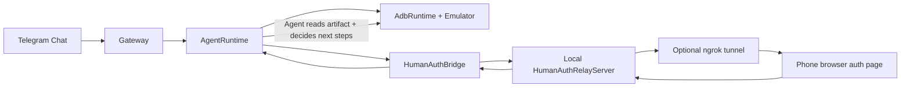
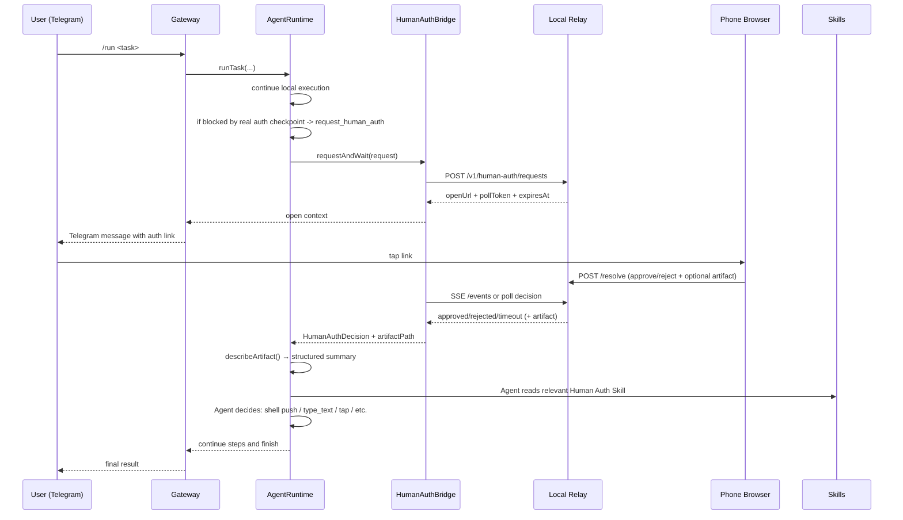

# Remote Human Authorization

This page documents the implemented authorization and delegation system used by OpenPocket today.

Design goal:

- keep long-running automation inside local emulator task loop
- ask user on phone only when true real-world authorization/data is required
- resume VM flow with auditable, scoped delegation
- **Agent-driven artifact usage**: runtime only saves and describes artifacts; the Agent decides how to apply them

## Boundary Policy

### Handled locally in emulator (no human auth)

- Android runtime permission dialogs inside emulator (`permissioncontroller`, `packageinstaller`)
- runtime auto-detects and taps allow/reject target based on policy

### Escalated to human auth

- real-device/sensitive checkpoints (OTP, camera capture, biometric-like approval, payment, OAuth, etc.)
- any step where model explicitly emits `request_human_auth`
- Capability Probe detects hardware access (camera, microphone, location, photos) from foreground app

## Template-Driven Human Auth Portal

Human Auth pages are no longer fixed to one hardcoded layout.
`request_human_auth` can include an optional `uiTemplate` object, and relay renders each request page from:

- a fixed secure shell (top title, remote takeover section, full context section)
- plus sanitized per-request middle/approve customization from agent

Template controls can define:

- dynamic title/summary/hint
- form schema (custom fields and validation)
- style variables (brand/background/font)
- agent-generated middle section (`middleHtml`, `middleCss`, `middleScript`)
- agent-generated approve hook (`approveScript`)
- reusable template file path from Agent Loop coding flow (`templatePath`, JSON in workspace)
- allowed attachment channels (text/location/photo/audio/file)
- artifact policy (`artifactKind`, `requireArtifactOnApprove`)

Portal security:

- CSP meta tag restricts network to same-origin (`connect-src 'self'`)
- one-time token model for open/poll channels
- `middleScript`/`approveScript` execute via `new Function()` with CSP network isolation

Portal capabilities:

- Camera: `getUserMedia` live preview + canvas capture, or file input with `capture` attribute
- Microphone: `MediaRecorder` browser recording with playback preview, or file upload
- Photo album: multi-select file input (single or batch)
- Location: `navigator.geolocation` + manual lat/lon input
- File: generic file upload
- Audio: recording + file upload with playback

## Why This Exists

Some flows cannot be completed from emulator-only UI automation:

- identity checks (2FA, OTP)
- real-world inputs (camera image, QR payload, live location)
- policy-gated confirmation steps

OpenPocket handles this with split architecture:

- VM side: continuous autonomous execution
- phone side: explicit authorization + optional delegation artifact

## Architecture



## End-to-End Sequence (Agentic Delegation)



## Request and Token Model

Each request has:

- `requestId`
- `openToken` (phone web page token)
- `pollToken` (runtime polling token)
- `expiresAt`
- immutable context (`task`, `sessionId`, `step`, `capability`, `instruction`, `currentApp`)

Security characteristics:

- one-time scoped open token hash
- separate poll token hash
- timeout auto-resolution (`pending -> timeout`)
- optional relay API bearer auth (`humanAuth.apiKey` / `humanAuth.apiKeyEnv`)

## Decision Notification

The Bridge supports two notification mechanisms:

1. **SSE (preferred)**: `GET /v1/human-auth/requests/:id/events?pollToken=...` — instant push when decision is made. Server sends keepalive every 15 seconds with proactive timeout checks.
2. **Polling (fallback)**: `GET /v1/human-auth/requests/:id?pollToken=...` — traditional interval-based polling.

Bridge tries SSE first; if the connection fails, it falls back to polling automatically.

## Agentic Delegation Model

**The runtime does NOT auto-apply delegation artifacts.** After human auth approval:

1. Runtime saves the artifact file to `state/human-auth-artifacts/`.
2. Runtime calls `describeArtifact()` to generate a structured summary (kind, size, fields, etc.).
3. The summary is returned to the Agent as part of the tool result.
4. **The Agent decides what to do** based on the artifact description and the current screen state.

This is guided by **Human Auth Skills** — markdown files in `skills/` that teach the Agent how to handle each capability type.

### Available Skills

| Skill | Capability | What it teaches |
|-------|-----------|----------------|
| `human-auth-delegation` | Overview | General flow and artifact types |
| `human-auth-camera` | `camera` | Push photo, navigate picker |
| `human-auth-photos` | `photos` | Single/multi photo, gallery import |
| `human-auth-microphone` | `microphone` | Push audio, file upload |
| `human-auth-location` | `location` | GPS injection (emulator) / manual input (device) |
| `human-auth-oauth` | `oauth` | Read credentials, type into login fields |
| `human-auth-payment` | `payment` | Read card fields, fill checkout form |
| `human-auth-sms-2fa` | `sms` / `2fa` | Read code, type into verification field |
| `human-auth-qr` | `qr` | QR scan result, manual entry |
| `human-auth-nfc` | `nfc` | NFC/RFID data handling |
| `human-auth-biometric` | `biometric` | Biometric fallback to PIN |
| `human-auth-contacts-data` | `contacts` / `calendar` / `files` | File import flows |

Contributors can add new capabilities by creating a new `skills/human-auth-<name>/SKILL.md` file — no TypeScript code changes required.

## Delegation Artifact Types

Remote approval may include optional artifact payload.

| Capability | Typical payload from phone | Agent handling (skill-guided) |
| --- | --- | --- |
| `sms`, `2fa`, `qr` | JSON `{ kind: "text" \| "qr_text", value }` | Agent reads artifact, types code into focused field |
| `oauth` | JSON `{ kind: "credentials", username, password }` | Agent reads artifact, taps login fields, types values, deletes artifact |
| `payment` | JSON `{ kind: "payment_card", fields... }` | Agent reads artifact, fills card fields, deletes artifact |
| `location` | JSON `{ kind: "geo", lat, lon }` | Agent runs `shell("adb emu geo fix ...")` or types coordinates |
| `camera`, `photos` | Image file (JPEG/PNG) or JSON `{ kind: "photos_multi" }` | Agent runs `shell("adb push ...")`, triggers media scan, navigates picker |
| `microphone` | Audio file (WebM/OGG) | Agent pushes audio file, navigates app file picker |
| `nfc`, `biometric`, `voice` | JSON or approval signal | Agent reads data and applies per skill guidance |

**Sensitive artifact cleanup:** Skills instruct the Agent to delete credential and payment artifacts after use via `exec("rm <path>")`.

**Sensitive data in logs:** OTP/verification code values are NOT written to session logs. Only `value_length=N` is logged. The Agent reads the actual value from the artifact file.

## Scenario-by-Scenario Behavior

### 1) User account login (`oauth`)

- Trigger: app login wall requires sensitive credentials.
- User action: fill credentials on Human Auth page (or use Remote Takeover), then `Approve`.
- Agent receives: artifact description with `artifact_kind=credentials`, `has_username=true`, `has_password=true`.
- Agent reads the `human-auth-oauth` skill, reads the artifact file, taps username field, types username, taps password field, types password, taps sign-in button, then deletes the artifact.

### 2) Permission authorization

- Android runtime permission dialogs inside emulator are handled locally by policy (no remote interrupt).
- Real-device capability needs (camera, microphone, location, photos) detected by Capability Probe trigger Human Auth automatically.
- User action: provide delegated data (photo/audio/location/text) and approve/reject.
- Agent receives: artifact description. Agent reads the relevant skill and decides how to use the data.

### 3) SMS verification code (`sms`)

- Trigger: task needs a one-time SMS code.
- User action: enter code via Human Auth web page text attachment.
- Agent receives: `artifact_kind=text`, `value_length=6`.
- Agent reads artifact to get code, types it into verification field.

### 4) Camera photo (`camera`)

- Trigger: app needs camera photo (detected by Capability Probe or Agent).
- User action: take photo on Human Auth page.
- Agent receives: `artifact_type=image/jpeg`.
- Agent pushes file to `/sdcard/Download/`, triggers media scan, navigates app picker to select file.

## Relay Modes

### Local relay only (LAN)

- `humanAuth.useLocalRelay=true`
- `humanAuth.tunnel.provider=none`
- phone must reach local network address

### Local relay + ngrok (remote phone)

- `humanAuth.useLocalRelay=true`
- `humanAuth.tunnel.provider=ngrok`
- `humanAuth.tunnel.ngrok.enabled=true`
- `NGROK_AUTHTOKEN` (or config token) configured

Gateway startup auto-brings relay/tunnel up when enabled.

## Telegram Integration

When blocked by auth checkpoint:

- gateway sends request summary
- includes one-tap link when available
- manual fallback commands always available:
  - `/auth pending`
  - `/auth approve <request-id> [note]`
  - `/auth reject <request-id> [note]`

For `sms`/`2fa`, plain code reply (4-10 digits) can resolve pending request directly.

## Test Methodology

### 1) Preflight

```bash
openpocket config-show
openpocket telegram whoami
openpocket emulator status
openpocket gateway start
```

### 2) Run full E2E scenario

```bash
openpocket test permission-app run --case camera --chat <telegram_chat_id>
```

### 3) Validate agentic delegation

Inspect latest session file and verify:

- `Human auth approved|rejected|timeout`
- `artifact_path=...`
- `artifact_kind=...`
- Agent's subsequent steps show it reading the artifact and applying it (e.g., `shell adb push ...` or `type_text ...`)

### 4) Failure drills

Simulate faults: stop tunnel, reject request, let request timeout. Verify task does not hang.

## Operational Observability

Primary artifacts:

- relay request state: `state/human-auth-relay/requests.json`
- uploaded artifacts: `state/human-auth-artifacts/`
- task trace: `workspace/sessions/`
- gateway logs containing `[OpenPocket][human-auth]`
- Human Auth skills: `skills/human-auth-*/SKILL.md`

## Current Limits

- browser permission behavior differs by Telegram in-app browser and mobile OS
- real-device GPS injection not supported on non-rooted devices (Agent falls back to manual coordinate input)
- ngrok free tier allows only one active session; duplicates can break link generation
- live camera/microphone streaming (WebRTC) is not implemented; current model is capture-then-upload
