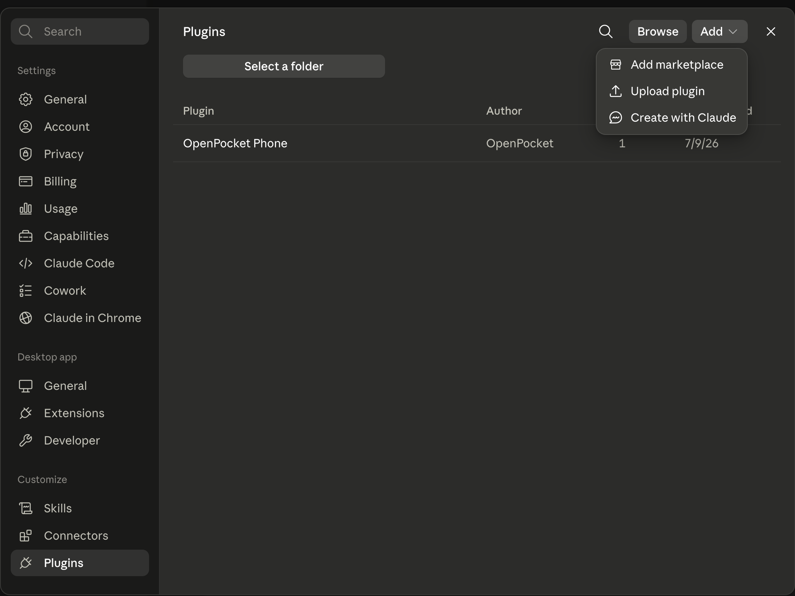
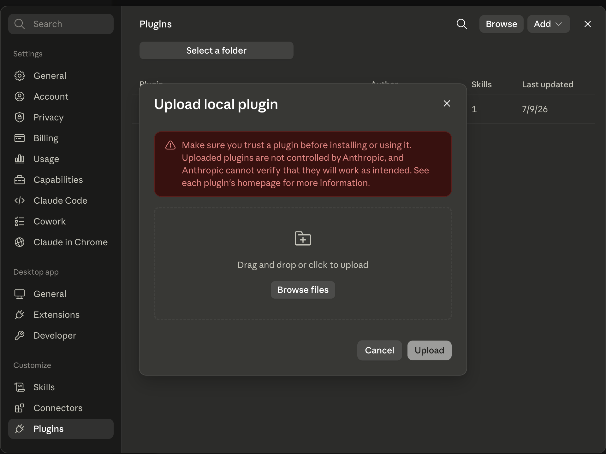
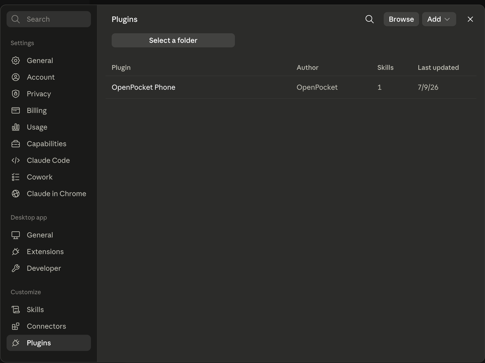

# OpenPocket Phone For Claude Code

This directory is the native Claude Code plugin for OpenPocket Phone. It packages a `phone-use` skill and a self-contained MCP runtime with 23 Android tools for emulator and ADB-authorized physical-phone control.

It is independent from the Codex package at `plugins/openpocket-phone/`. Both plugins are generated from the same OpenPocket MCP source and expose the same tool surface.

## Requirements

- Node.js 20 or newer
- Android SDK platform-tools (`adb`)
- Android Emulator tools for emulator targets
- an existing AVD or an ADB-authorized Android phone

The plugin creates `~/.openpocket/config.json` with an emulator-first default when the file does not exist. The default AVD name is `OpenPocket_AVD`.

## Claude Desktop: Upload The Plugin

The ready-to-upload archive is:

[`releases/openpocket-phone-claude.zip`](releases/openpocket-phone-claude.zip)

No repository build is required for this path.

1. Open Claude Desktop **Settings > Plugins**.
2. Select **Add > Upload plugin**.
3. Select `openpocket-phone-claude.zip`.
4. Review the local-plugin warning and select **Upload**.
5. Confirm that **OpenPocket Phone** appears in the plugin list.
6. Start a new Claude Code task.







Use this first prompt:

```text
Use OpenPocket Phone. Call target_status and report targetType, avdName,
devices, bootedDevices, resolvedDeviceId, resolveError, and ambiguousTarget.
```

Start a new task after every plugin install or update. Existing tasks keep the tool registry created when they started.

## Claude Code CLI: One Command

From the OpenPocket repository root:

```bash
npm run phone-use:install -- claude-code --target emulator
```

The installer prepares the runtime, adds the `openpocket-local` marketplace, installs `openpocket-phone@openpocket-local` at user scope, migrates an older raw `openpocket-phone` MCP entry when present, and runs the 23-tool Doctor check.

Verify the native plugin:

```bash
claude plugin list
```

Then open a fresh Claude Code session and use `/plugin` or `/mcp` to inspect the loaded components.

## Load Without Installing

Plugin developers can load the directory or zip for one Claude Code process:

```bash
claude --plugin-dir ./plugins/openpocket-phone-claude
claude --plugin-dir ./plugins/openpocket-phone-claude/releases/openpocket-phone-claude.zip
```

## Physical Android Phone

Authorize the device, then install with its ADB serial:

```bash
adb devices -l
npm run phone-use:install -- claude-code --device <serial>
```

OpenPocket does not bypass device trust prompts, lock screens, account prompts, or Android security controls.

## Package Layout

| Path | Purpose |
| --- | --- |
| `.claude-plugin/plugin.json` | Native Claude Code plugin manifest |
| `.mcp.json` | Plugin-scoped stdio MCP registration |
| `skills/phone-use/SKILL.md` | Phone-use workflow and safety instructions |
| `runtime/openpocket-phone-server.mjs` | Self-contained MCP runtime |
| `runtime/openpocket-ime.apk` | Unicode-safe Android input helper |
| `runtime/screen-awake-worker.js` | Screen-awake helper |
| `releases/openpocket-phone-claude.zip` | Desktop upload artifact |

Claude namespaces the bundled MCP tools automatically. Users should ask for `target_status`, `ui_snapshot`, `tap_text`, and the other OpenPocket tools by their short names; the host handles the internal plugin namespace.

## Rebuild And Validate

From the repository root:

```bash
npm install
npm run phone-use:package
claude plugin validate plugins/openpocket-phone-claude --strict
```

The package command rebuilds the shared runtime, synchronizes the Codex plugin runtime, and refreshes this zip.

For the complete Codex and Claude install matrix, target setup, tool list, and troubleshooting, see the [OpenPocket Phone plugin guide](../openpocket-phone/README.md).
